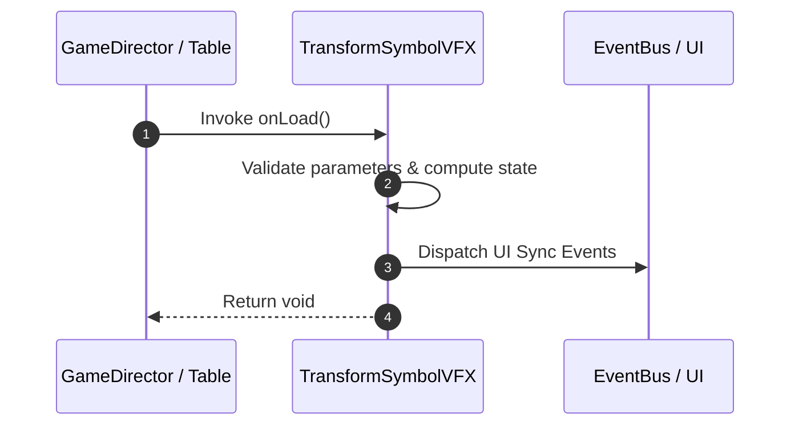

# 📖 `TransformSymbolVFX.onLoad()`

<!-- convention-summary-start -->
### TransformSymbolVFX.onLoad Line-by-Line Method Specification Summary

- **Core Architecture / Purpose**: Technical reference, API contract, and integration guide for TransformSymbolVFX.onLoad Line-by-Line Method Specification.
- **Key Mechanisms & Design**: Encapsulates core algorithms, event hooks, and performance optimizations within the slot framework runtime.
- **Domain Capabilities**: cc_slot_mechanics, 05_methods
- **Scope & Code Paths**: `assets/cc-common/cc-slot-mechanics/TransformSymbol/scripts/TransformSymbolVFX.ts`
- **Related Docs**: [Master Index](../INDEX.md)
<!-- convention-summary-end -->


---

## 1. Method Signature & Overview

```typescript
public onLoad(): void
```

- **Declaring Class**: `TransformSymbolVFX` (`assets/cc-common/cc-slot-mechanics/TransformSymbol/scripts/TransformSymbolVFX.ts`)
- **Source Code Location**: Lines 11 to 21
- **Execution Complexity**: $O(1)$ fast synchronous calculation or controlled timer Promise.

---

## 2. Complete Source Code Implementation

```typescript
	onLoad(): void {
		if (!this.skeleton) {
			this.skeleton = this.node.getComponent(sp.Skeleton);
		}

		if (this.skeleton) {
			this.node.on('PLAY_ANIMATION', this.onPlayAnimation, this);
			this.node.on('STOP_ANIMATION', this.onStopAnimation, this);
		}
		this.node.active = false;
	}
```

---

## 3. Line-by-Line Code Breakdown

| Line # | Code Snippet | Technical Analysis & Engine Behavior |
| :---: | :--- | :--- |
| **11** | `onLoad(): void {` | Method entry signature declaring `onLoad()` with return type `void`. |
| **12** | `if (!this.skeleton) {` | Conditional branch evaluation guarding edge cases or prerequisites. |
| **13** | `this.skeleton = this.node.getComponent(sp.Skeleton);` | Queries attached component instance from scene graph node. |
| **14** | `}` | Method exit boundary, closing block scope. |
| **15** | `` | Applies operational logic and state mutation. |
| **16** | `if (this.skeleton) {` | Conditional branch evaluation guarding edge cases or prerequisites. |
| **17** | `this.node.on('PLAY_ANIMATION', this.onPlayAnimation, this);` | Applies operational logic and state mutation. |
| **18** | `this.node.on('STOP_ANIMATION', this.onStopAnimation, this);` | Applies operational logic and state mutation. |
| **19** | `}` | Method exit boundary, closing block scope. |
| **20** | `this.node.active = false;` | Applies operational logic and state mutation. |
| **21** | `}` | Method exit boundary, closing block scope. |

---

## 4. Data Flow & State Lifecycle



---

## 5. Production Gotchas & Edge Cases

1. **Null Guarding**: Always ensure caller passes non-null parameters or handles undefined fallbacks.
2. **Fast-Stop Safety**: If user triggers fast-stop during execution, ensure timers are cancelled cleanly via `unscheduleAllCallbacks()`.
