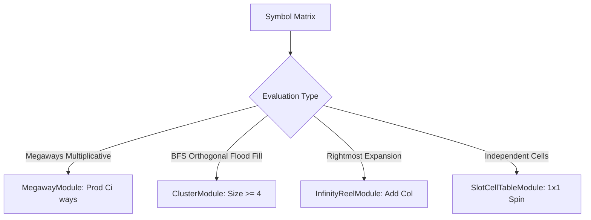

# 🌐 Ways & Grid Systems Architecture Index

<!-- convention-summary-start -->
### Ways & Grid Systems Architecture Index Summary

- **Core Architecture / Purpose**: Technical reference, API contract, and integration guide for Ways & Grid Systems Architecture Index.
- **Key Mechanisms & Design**: Encapsulates core algorithms, event hooks, and performance optimizations within the slot framework runtime.
- **Domain Capabilities**: cc_slot_mechanics, 01_ways_and_grid_systems
- **Scope & Code Paths**: `./01_megaways_combinatorial_math.md`, `./02_cluster_pay_bfs_grouping.md`, `./03_infinity_reel_expansion_engine.md`
- **Related Docs**: [`01_megaways_combinatorial_math.md`](./01_megaways_combinatorial_math.md), [`02_cluster_pay_bfs_grouping.md`](./02_cluster_pay_bfs_grouping.md), [`03_infinity_reel_expansion_engine.md`](./03_infinity_reel_expansion_engine.md)
<!-- convention-summary-end -->

---

## 1. Subsystem Mission

The **Ways & Grid Systems** govern non-linear slot evaluation and dynamic board geometries that move beyond traditional static paylines. This includes:
- **Megaways Engine**: Variable dynamic symbol heights (2..7 symbols per reel) producing up to $117,649$ ways to win.
- **Cluster Pay Engine**: Orthogonal Breadth-First Search (BFS) connected-component grouping.
- **Infinity Reels**: Dynamic rightward column expansion upon hitting winning symbol connections.
- **Slot Cell Table**: Decoupled, individually spinning matrix cells.

---

## 2. Topic Breakdown & Navigation

1. **[`01_megaways_combinatorial_math.md`](./01_megaways_combinatorial_math.md)**: Combinatorial formula $\prod_{i=0}^{C-1} S_i$, height randomization algorithms, and ways label formatting.
2. **[`02_cluster_pay_bfs_grouping.md`](./02_cluster_pay_bfs_grouping.md)**: 4-directional BFS flood fill algorithm, cluster boundary detection, and payout mapping.
3. **[`03_infinity_reel_expansion_engine.md`](./03_infinity_reel_expansion_engine.md)**: Dynamic column instantiation, camera pan offset math, and respin loop synchronization.
4. **[`04_slot_cell_table_independent_spinning.md`](./04_slot_cell_table_independent_spinning.md)**: Cell-based reel abstraction, independent stop physics, and grid layout matrices.
