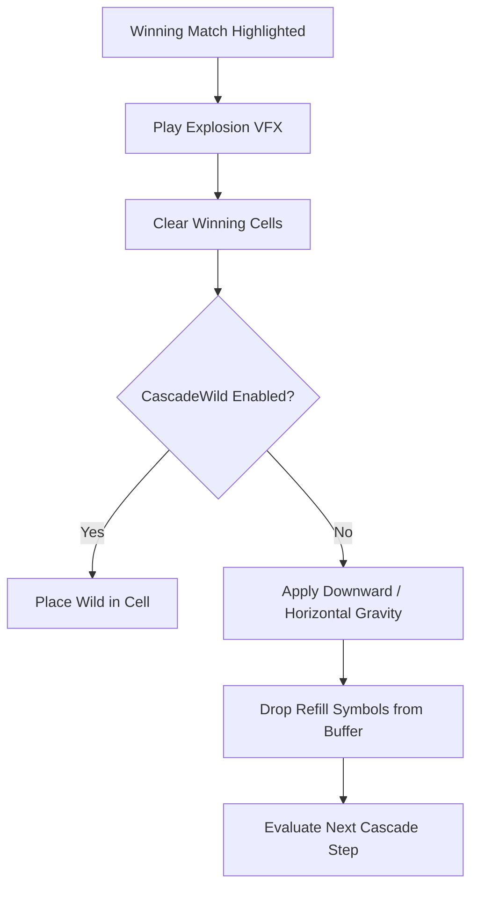

# 🌊 Cascades & Physics Systems Architecture Index

<!-- convention-summary-start -->
### Cascades & Physics Systems Architecture Index Summary

- **Core Architecture / Purpose**: Technical reference, API contract, and integration guide for Cascades & Physics Systems Architecture Index.
- **Key Mechanisms & Design**: Encapsulates core algorithms, event hooks, and performance optimizations within the slot framework runtime.
- **Domain Capabilities**: cc_slot_mechanics, 02_cascade_and_physics_systems
- **Scope & Code Paths**: `./01_tumbling_vertical_cascade_physics.md`, `./02_horizontal_avalanche_gravity.md`, `./03_cascade_wild_generation_pipeline.md`
- **Related Docs**: [`01_tumbling_vertical_cascade_physics.md`](./01_tumbling_vertical_cascade_physics.md), [`02_horizontal_avalanche_gravity.md`](./02_horizontal_avalanche_gravity.md), [`03_cascade_wild_generation_pipeline.md`](./03_cascade_wild_generation_pipeline.md)
<!-- convention-summary-end -->

---

## 1. Subsystem Mission

The **Cascades & Physics Systems** coordinate dynamic board updates where winning symbols explode and new symbols fall into empty spaces through gravity simulations:
- **Tumbling Reels**: Classic vertical gravity drops with bounce easing.
- **Horizontal Cascades**: Side-sliding avalanche physics.
- **Cascade Wild Generation**: Spawning Wild multipliers in vacated winning cells.
- **Symbol Elimination**: Royal removal meters clearing low-paying symbols across cascade streaks.

---

## 2. Topic Breakdown

1. **[`01_tumbling_vertical_cascade_physics.md`](./01_tumbling_vertical_cascade_physics.md)**: Drop distance calculations, bounce easing curves (`cubicOut` / `bounceOut`), and multi-step cascades.
2. **[`02_horizontal_avalanche_gravity.md`](./02_horizontal_avalanche_gravity.md)**: Left-to-right horizontal shift math and column sliding physics.
3. **[`03_cascade_wild_generation_pipeline.md`](./03_cascade_wild_generation_pipeline.md)**: Rules for generating Wilds from 4+ cluster explosions.
4. **[`04_progressive_symbol_elimination.md`](./04_progressive_symbol_elimination.md)**: Progressive elimination of card royals ($10, J, Q, K, A$) on successive cascade wins.
