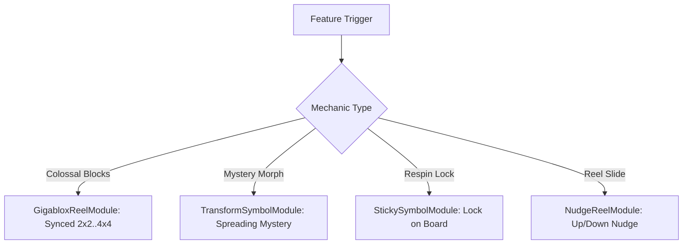

# 🧱 Colossal & Transform Systems Architecture Index

<!-- convention-summary-start -->
### Colossal & Transform Systems Architecture Index Summary

- **Core Architecture / Purpose**: Technical reference, API contract, and integration guide for Colossal & Transform Systems Architecture Index.
- **Key Mechanisms & Design**: Encapsulates core algorithms, event hooks, and performance optimizations within the slot framework runtime.
- **Domain Capabilities**: cc_slot_mechanics, 03_colossal_and_transform_systems
- **Scope & Code Paths**: `./01_gigablox_colossal_blocks_sync.md`, `./02_mega_reel_multi_size_expansion.md`, `./03_transform_symbol_mystery_morphs.md`
- **Related Docs**: [`01_gigablox_colossal_blocks_sync.md`](./01_gigablox_colossal_blocks_sync.md), [`02_mega_reel_multi_size_expansion.md`](./02_mega_reel_multi_size_expansion.md), [`03_transform_symbol_mystery_morphs.md`](./03_transform_symbol_mystery_morphs.md)
<!-- convention-summary-end -->

---

## 1. Subsystem Mission

The **Colossal & Transform Systems** manage giant multi-cell symbols, synchronized reel strips, spreading mystery transformations, sticky symbol locks, and nudging reel physics:
- **Gigablox**: Synchronized $2\times 2, 3\times 3, 4\times 4$ giant symbol blocks.
- **Mega Reel**: Multi-size reel column layouts.
- **Transform Symbol**: Spreading mystery morphs.
- **Sticky Symbol**: Locking winning symbols during respin cycles.
- **Nudge Reel**: Up/down reel sliding to lock full-height Wild stacks.

---

## 2. Topic Breakdown

1. **[`01_gigablox_colossal_blocks_sync.md`](./01_gigablox_colossal_blocks_sync.md)**: Colossal block reel synchronization and sub-symbol payline splitting.
2. **[`02_mega_reel_multi_size_expansion.md`](./02_mega_reel_multi_size_expansion.md)**: Variable row heights and multi-size reel column layouts.
3. **[`03_transform_symbol_mystery_morphs.md`](./03_transform_symbol_mystery_morphs.md)**: Spreading mystery animations and golden symbol transformations.
4. **[`04_sticky_symbol_respin_locking.md`](./04_sticky_symbol_respin_locking.md)**: State locking, sticky node overlays, and Hold-and-Respin loops.
5. **[`05_nudge_reel_step_physics.md`](./05_nudge_reel_step_physics.md)**: Nudging animation tweens and multiplier increments per nudge step.
6. **[`06_stacked_reel_synced_strips.md`](./06_stacked_reel_synced_strips.md)**: Synchronized symbol strip rolling and identical column reveal.
