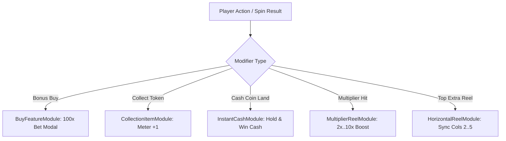

# 🎯 Metagame & Modifiers Systems Architecture Index

<!-- convention-summary-start -->
### Metagame & Modifiers Systems Architecture Index Summary

- **Core Architecture / Purpose**: Technical reference, API contract, and integration guide for Metagame & Modifiers Systems Architecture Index.
- **Key Mechanisms & Design**: Encapsulates core algorithms, event hooks, and performance optimizations within the slot framework runtime.
- **Domain Capabilities**: cc_slot_mechanics, 04_metagame_and_modifiers_systems
- **Scope & Code Paths**: `./01_buy_feature_hud_and_pricing_math.md`, `./02_collection_item_metagame_meters.md`, `./03_instant_cash_hold_and_win.md`
- **Related Docs**: [`01_buy_feature_hud_and_pricing_math.md`](./01_buy_feature_hud_and_pricing_math.md), [`02_collection_item_metagame_meters.md`](./02_collection_item_metagame_meters.md), [`03_instant_cash_hold_and_win.md`](./03_instant_cash_hold_and_win.md)
<!-- convention-summary-end -->

---

## 1. Subsystem Mission

The **Metagame & Modifiers Systems** handle player empowerment features, persistent collection progression, direct cash gathering, and auxiliary reels:
- **Buy Feature**: Direct entry into Free Spins / Bonus mode via upfront bet multiplier pricing.
- **Collection Item**: Persistent metagame tokens and milestone progression meters.
- **Instant Cash**: Hold & Win cash coins and collector gathering symbols.
- **Multiplier & Multiplier Reel**: Progressive multiplier meters and dedicated spinning multiplier wheels.
- **Horizontal Reel**: Megaways auxiliary top reel syncing.

---

## 2. Topic Breakdown

1. **[`01_buy_feature_hud_and_pricing_math.md`](./01_buy_feature_hud_and_pricing_math.md)**: Pricing formulas ($100\times, 200\times$), modal confirmation dialogs, and instant mode dispatch.
2. **[`02_collection_item_metagame_meters.md`](./02_collection_item_metagame_meters.md)**: Token collection fly tweens, milestone state persistence, and super feature triggers.
3. **[`03_instant_cash_hold_and_win.md`](./03_instant_cash_hold_and_win.md)**: Direct currency values on coin symbols and collector sweep summation.
4. **[`04_multiplier_meters_and_multiplier_reels.md`](./04_multiplier_meters_and_multiplier_reels.md)**: Dedicated multiplier columns and accumulative cascade multiplier steps.
5. **[`05_horizontal_extra_reel_megaways_sync.md`](./05_horizontal_extra_reel_megaways_sync.md)**: 4-cell horizontal top reel synchronizing with vertical columns 2, 3, 4, 5.
