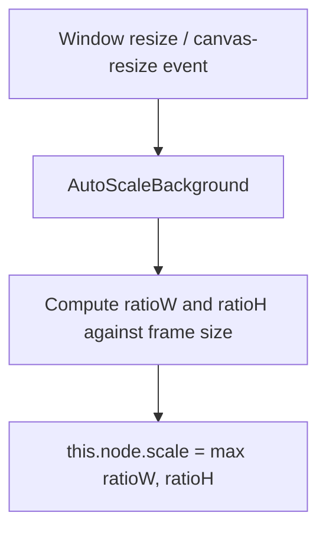

# 🏛️ AutoScaleBackgroundModule Architectural Role & Background Cover Scaler

<!-- convention-summary-start -->
### AutoScaleBackgroundModule Architectural Role & Background Cover Scaler Summary

- **Core Architecture / Purpose**: Technical reference, API contract, and integration guide for AutoScaleBackgroundModule Architectural Role & Background Cover Scaler.
- **Key Mechanisms & Design**: Encapsulates core algorithms, event hooks, and performance optimizations within the slot framework runtime.
- **Domain Capabilities**: cc_slot_module, 01_overview
- **Scope & Code Paths**: `assets/cc-common/cc-slot-module/`
- **Related Docs**: [Master Index](../INDEX.md)
<!-- convention-summary-end -->

---

## 1. Architectural Mission

`AutoScaleBackgroundModule` (declared as class `AutoScaleBackground`) is the **aspect-ratio preserving background cover scaler** mounted on main game backgrounds (`Canvas/Director/GameMode/BG_MainG`). It guarantees letterbox-free cover scaling across arbitrary device screen resolutions by calculating:

$$\text{scale} = \max\left(\frac{\text{widthView}}{\text{convertWithBG}}, \frac{\text{heightView}}{\text{convertHeightBG}}\right)$$

