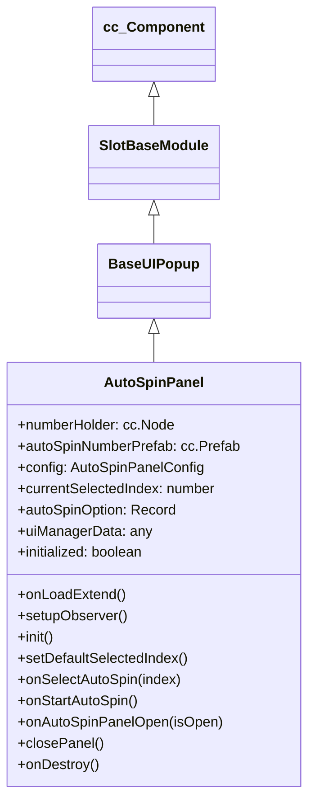

# 🏛️ AutoSpinPanel Architecture & Role

<!-- convention-summary-start -->
### AutoSpinPanel Architecture & Role Summary

- **Core Architecture / Purpose**: Technical reference, API contract, and integration guide for AutoSpinPanel Architecture & Role.
- **Key Mechanisms & Design**: Encapsulates core algorithms, event hooks, and performance optimizations within the slot framework runtime.
- **Domain Capabilities**: cc_slot_module, 01_overview
- **Scope & Code Paths**: `assets/cc-common/cc-slot-module/`
- **Related Docs**: [Master Index](../INDEX.md)
<!-- convention-summary-end -->


`AutoSpinPanel` is the bottom-sheet drawer modal for selecting automated spin round counts (e.g. 10, 20, 50, 100, ∞) in portrait slot layouts. Inheriting from `BaseUIPopup`, it instantiates option buttons dynamically via `AutoSpinPanelConfig`, manages option highlight states, and initiates auto-spin execution via `GameLogicUIEvents.START_AUTO_SPIN`.

---

## 1. Architectural Role

- **Dynamic Number Grid**: Instantiates `autoSpinNumberPrefab` nodes into `numberHolder` for each entry in `config.AUTO_SPIN_NUMBERS`.
- **Default Selection Guard**: Highlights the last option (or default limit) on modal opening.
- **Auto Spin Trigger**: Emits `START_AUTO_SPIN` with the chosen round count and automatically dismisses the drawer.

---

## 2. Component Hierarchy

Canonical Node Path: `Canvas/Director/Popup/AutoSpinPanel`

```text
AutoSpinPanel (AutoSpinPanel, FadePopupBehavior)
├── Background (cc.Sprite)
├── Title (cc.Label)
├── NumberHolder (cc.Node - Grid container)
│   ├── AutoSpinNumber_0 (cc.Node - e.g. 10)
│   ├── AutoSpinNumber_1 (cc.Node - e.g. 20)
│   └── AutoSpinNumber_2 (cc.Node - e.g. 50)
├── StartAutoSpinBtn (cc.Button)
└── CloseBtn (cc.Button)
```

---

## 3. Inheritance Diagram


