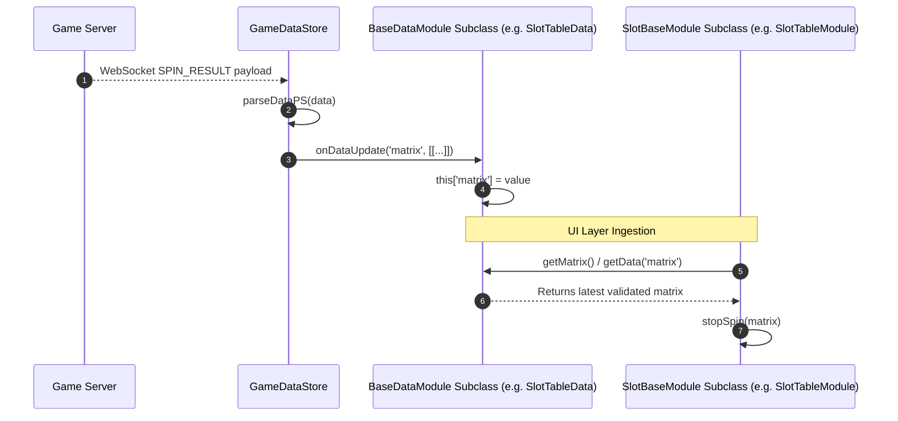

# 🌀 BaseDataModule Data Distribution Spin Phase Breakdown

<!-- convention-summary-start -->
### BaseDataModule Data Distribution Spin Phase Breakdown Summary

- **Core Architecture / Purpose**: Defines network protocol, socket packet lifecycle, state persistence, and error handling for BaseDataModule Data Distribution Spin Phase Breakdown.
- **Key Mechanisms & Design**: Handles WebSocket frame dispatch, acknowledgment confirmation, state resume, and resilient synchronization between client DataStore and Backend Gateway.
- **Domain Capabilities**: cc_slot_module, 02_game_flow
- **Scope & Code Paths**: `assets/cc-common/cc-slot-module/`
- **Related Docs**: [Master Index](../INDEX.md)
<!-- convention-summary-end -->

## 1. Sequence Execution

