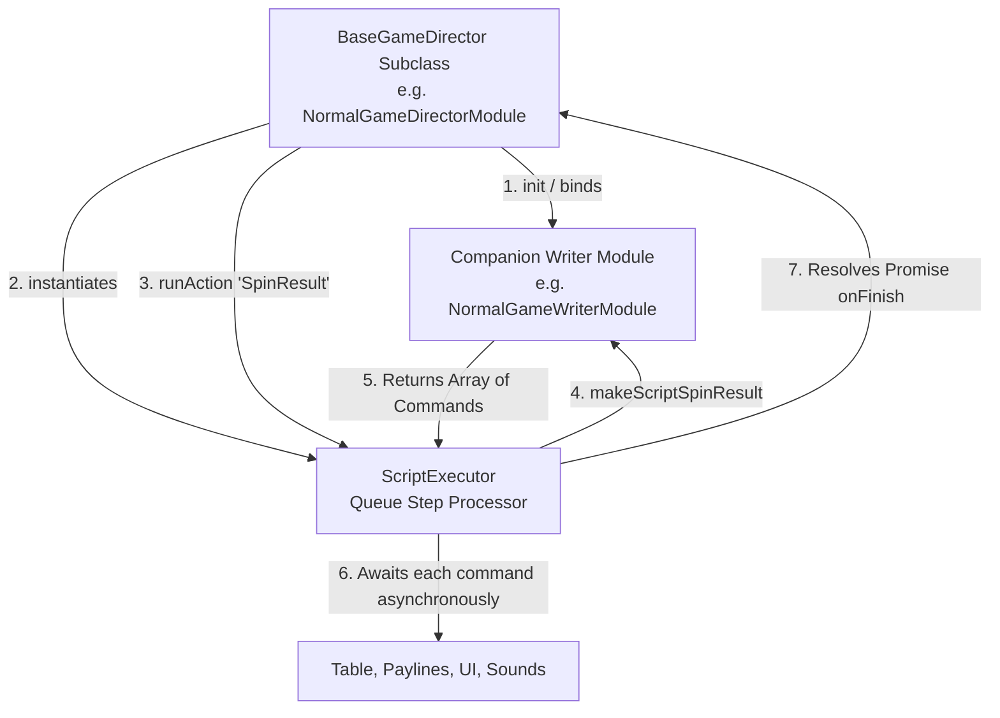

# 🏛️ BaseGameDirector State Machine Orchestrator Architecture

<!-- convention-summary-start -->
### BaseGameDirector State Machine Orchestrator Architecture Summary

- **Core Architecture / Purpose**: Technical reference, API contract, and integration guide for BaseGameDirector State Machine Orchestrator Architecture.
- **Key Mechanisms & Design**: Encapsulates core algorithms, event hooks, and performance optimizations within the slot framework runtime.
- **Domain Capabilities**: cc_slot_module, 01_overview
- **Scope & Code Paths**: `assets/cc-common/cc-slot-module/GameMode/Core/BaseGameDirector.ts`
- **Related Docs**: [Master Index](../INDEX.md)
<!-- convention-summary-end -->

## 1. Executive Summary & Purpose

`BaseGameDirector` (`assets/cc-common/cc-slot-module/GameMode/Core/BaseGameDirector.ts`) is the **Abstract State Machine Orchestrator** in the `cc-common` Slot SDK.

It serves as the base class for all mode-specific directors (`GameModeDirectorModule`, `NormalGameDirectorModule`, `FreeGameDirectorModule`, `BonusGameDirectorModule`). By decoupling command script generation (Writers) from sequential execution (`ScriptExecutor`), `BaseGameDirector` provides an asynchronous, queue-driven pipeline for reel spins, payline sequences, and bonus cutscenes.

---

## 2. Core Responsibilities

1. **Director-Writer-Executor Triad Binding**: Binds companion `writer` and `director` instances on the active Node and constructs the `ScriptExecutor` bridge during `init()`.
2. **Asynchronous Action Dispatch**: Exposes `runAction(actionName, data)` returning a Promise that resolves only when all steps generated by the writer complete.
3. **Queue Cancellation & Fast Exit**: Provides `forceToExit()`, `onResetScript()`, and `onResetAllScripts()` to cancel inflight animations when switching modes or jumping to real mode.
4. **Speed Scaling Bridge**: Bridges `SlotGameSettings` speed configurations down to `ScriptExecutor` for Turbo and Fast-to-Result (FTR) execution.
