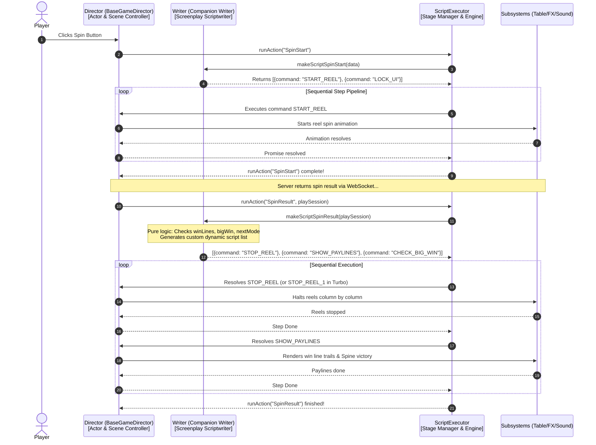

# 🎼 The Director-Writer-Executor Triad & Game Flow Coordination

<!-- convention-summary-start -->
### The Director-Writer-Executor Triad & Game Flow Coordination Summary

- **Core Architecture / Purpose**: Technical reference, API contract, and integration guide for The Director-Writer-Executor Triad & Game Flow Coordination.
- **Key Mechanisms & Design**: Encapsulates core algorithms, event hooks, and performance optimizations within the slot framework runtime.
- **Domain Capabilities**: cc_slot_module, 03_director_writer_integration
- **Scope & Code Paths**: `assets/cc-common/cc-slot-module/`
- **Related Docs**: [Master Index](../INDEX.md)
<!-- convention-summary-end -->

## 1. The Core Metaphor: The Theatre Triad

In the `cc-common` Slot framework, game flow orchestration is organized around a strict 3-way separation of concerns known as the **Director-Writer-Executor Triad**:

---

## 2. Roles Breakdown in the Game Flow

| Component | Architecture Role | Real-World Metaphor | What it MUST do | What it NEVER does |
| :--- | :--- | :--- | :--- | :--- |
| **`BaseGameDirector`** | **The Scene Controller & Actor** | *The Actor & Director on stage* | Holds node references (`Table`, `Wallet`, `Cutscenes`), listens to UI click events, implements concrete animation step methods (`STOP_REEL`, `SHOW_PAYLINES`). | Never compiles command lists directly; never hardcodes delays with `setTimeout`. |
| **`Companion Writer`** | **The Pure Script Generator** | *The Screenwriter writing the script* | Pure, synchronous logic. Inspects `data` / `playSession` and returns an array of declarative step objects: `[{ command: "...", data }]`. | Has **zero node references**, **no tweens**, **no async timers**, **no side effects**. |
| **`ScriptExecutor`** | **The Queue Step Engine** | *The Stage Manager running the cue sheet* | Drives the async execution loop, shifts commands one by one, routes commands to speed overrides (`STOP_REEL_1`), and handles emergency aborts (`forceToExit`). | Does not own scene nodes or create UI elements. |

---

## 3. Concrete Example: Dynamic Branching in Spin Result

When `runAction("SpinResult", playSession)` is dispatched:
1. The **Writer** checks `playSession`:
   * If `playSession.winLines.length > 0` ➔ Appends `{ command: "SHOW_PAYLINES" }`.
   * If `dataStore.isBigWin()` ➔ Appends `{ command: "TRIGGER_BIG_WIN_CUTSCENE" }`.
   * If `playSession.nextMode === 2` ➔ Appends `{ command: "SHOW_FREE_SPIN_INTRO" }`.
2. The **ScriptExecutor** guarantees that `TRIGGER_BIG_WIN_CUTSCENE` will **never start until `SHOW_PAYLINES` has finished its animation and resolved its Promise**.
3. If the user activates **Turbo Mode**, `ScriptExecutor` automatically re-routes `STOP_REEL` to `STOP_REEL_1` without requiring complex `if (isTurbo)` conditional branches throughout the codebase.
