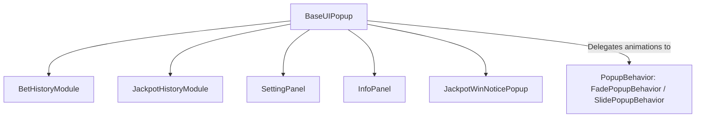

# 🏛️ BaseUIPopup Architectural Role & Abstract Modal Base Class

<!-- convention-summary-start -->
### BaseUIPopup Architectural Role & Abstract Modal Base Class Summary

- **Core Architecture / Purpose**: Technical reference, API contract, and integration guide for BaseUIPopup Architectural Role & Abstract Modal Base Class.
- **Key Mechanisms & Design**: Encapsulates core algorithms, event hooks, and performance optimizations within the slot framework runtime.
- **Domain Capabilities**: cc_slot_module, 01_overview
- **Scope & Code Paths**: `assets/cc-common/cc-slot-module/`
- **Related Docs**: [Master Index](../INDEX.md)
<!-- convention-summary-end -->

---

## 1. Architectural Mission

`BaseUIPopup` is the abstract base class for all modal dialogs in the slot game engine (`BetHistoryModule`, `JackpotHistoryModule`, `SettingPanel`, `InfoPanel`, `JackpotWinNoticePopup`). It standardizes popup transition behaviors (`PopupBehavior` / `FadePopupBehavior` / `SlidePopupBehavior`), handles sound playback on user interaction (`playSFXClick`), dispatches `CLOSE_ALL_POPUPS` to `GameLogic`, and manages animated show/hide lifecycles with completion callbacks (`togglePopup`).

---

## 2. Key Responsibilities

1. **Popup Behavior Delegation (`popupBehavior`)**:
   - Automatically attaches or acquires a `PopupBehavior` component (defaults to `FadePopupBehavior` if absent).
2. **Standardized Show / Hide API (`togglePopup` / `activePopup`)**:
   - Executes animated show/hide transitions with optional completion callbacks.
3. **Global Popup Dismissal (`closeAllPopups`)**:
   - Emits `GameLogicUIEvents.CLOSE_ALL_POPUPS` to cleanly dismiss all active dialogs.
