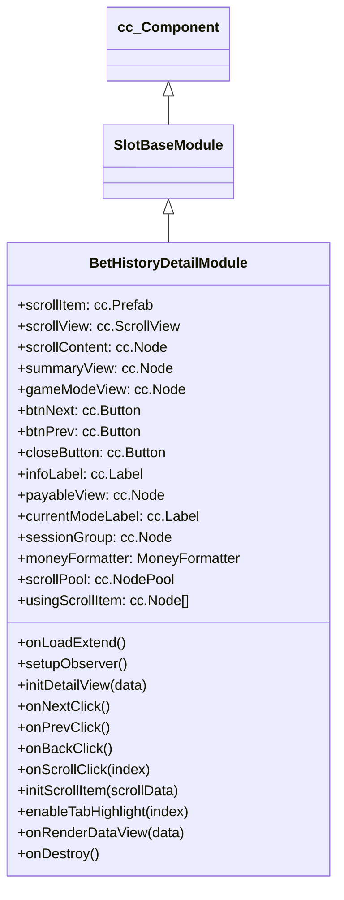

# 🏛️ BetHistoryDetailModule Architecture & Role

<!-- convention-summary-start -->
### BetHistoryDetailModule Architecture & Role Summary

- **Core Architecture / Purpose**: Technical reference, API contract, and integration guide for BetHistoryDetailModule Architecture & Role.
- **Key Mechanisms & Design**: Encapsulates core algorithms, event hooks, and performance optimizations within the slot framework runtime.
- **Domain Capabilities**: cc_slot_module, 01_overview
- **Scope & Code Paths**: `assets/cc-common/cc-slot-module/`
- **Related Docs**: [Master Index](../INDEX.md)
<!-- convention-summary-end -->


`BetHistoryDetailModule` is the granular round replay and step inspector component in the `cc-common` Slot Framework SDK. It inherits from `SlotBaseModule` and renders step-by-step game mode transitions (Normal Spin ➔ Free Spins ➔ Bonus Game picks ➔ Multipliers) with dynamic tab scrolling and pooled tab items.

---

## 1. Architectural Boundaries & System Role

- **Step & Mode Navigation**: Displays horizontal tab buttons (`scrollItem` inside `scrollView`) allowing players to inspect each step of a multi-stage slot round.
- **Dynamic Node Pooling**: Utilizes `cc.NodePool` (`ScrollHistoryPool`) for smooth checkout and recycling of step tab elements.
- **Summary vs Mode View Switching**: Automatically swaps between overall round payout summary (`summaryView`) and mode-specific matrix snapshots (`gameModeView`, `payableView`).
- **Currency & Jackpot Formatting**: Injects `MoneyFormatter` to render compound winnings and jackpot increments with localized currency symbols.

---

## 2. Component Hierarchy & Scene Placement

Canonical Node Path: `Canvas/Director/Popup/BetHistory/DetailView`

```text
DetailView (BetHistoryDetailModule)
├── Header
│   ├── CurrentModeLabel (cc.Label)
│   ├── InfoLabel (cc.Label - Step win & jackpot amount)
│   └── CloseButton (cc.Button)
├── ScrollView (cc.ScrollView - Tab navigation bar)
│   └── View/Content (cc.Node - scrollContent parent)
│       └── ScrollItem_0..N (cc.Node from scrollPool)
├── SummaryView (cc.Node - Full round settlement summary)
├── GameModeView (cc.Node - Matrix symbol grid snapshot)
├── PayableView (cc.Node - Line win breakdown)
├── SessionGroup (cc.Node - Session ID identifier label)
└── NavigationButtons
    ├── BtnPrev (cc.Button)
    └── BtnNext (cc.Button)
```

---

## 3. Inheritance Diagram


