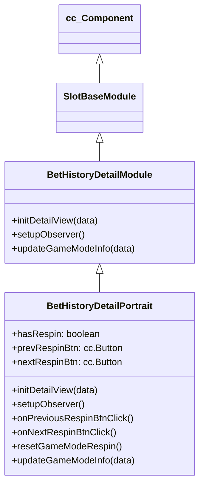

# 🏛️ BetHistoryDetailPortrait Architecture & Role

<!-- convention-summary-start -->
### BetHistoryDetailPortrait Architecture & Role Summary

- **Core Architecture / Purpose**: Technical reference, API contract, and integration guide for BetHistoryDetailPortrait Architecture & Role.
- **Key Mechanisms & Design**: Encapsulates core algorithms, event hooks, and performance optimizations within the slot framework runtime.
- **Domain Capabilities**: cc_slot_module, 01_overview
- **Scope & Code Paths**: `assets/cc-common/cc-slot-module/`
- **Related Docs**: [Master Index](../INDEX.md)
<!-- convention-summary-end -->

`BetHistoryDetailPortrait` is the portrait-specific spin round replay controller in the `cc-common` Slot Framework SDK. Inheriting from `BetHistoryDetailModule`, it specializes in Respin / Cascade waterfalls with dedicated `prevRespinBtn` and `nextRespinBtn` navigation buttons, custom respin data observers, and compact mobile layouts.

---

## 1. Architectural Role

- **Subclass of `BetHistoryDetailModule`**: Hides standard desktop ScrollView tabs in favor of compact left/right respin stepper buttons.
- **Respin State Observers**: Observes `isEnableNextRespin`, `isEnablePrevRespin`, `isActiveNextRespin`, and `isActivePrevRespin`.
- **Specialized History Payload**: Requests `eno.BET_DEFAULT_HISTORY_TYPE.RESPIN_PORTAIT` payload from `GameLogicUIEvents.INIT_BET_DETAIL`.

---

## 2. Inheritance Diagram

