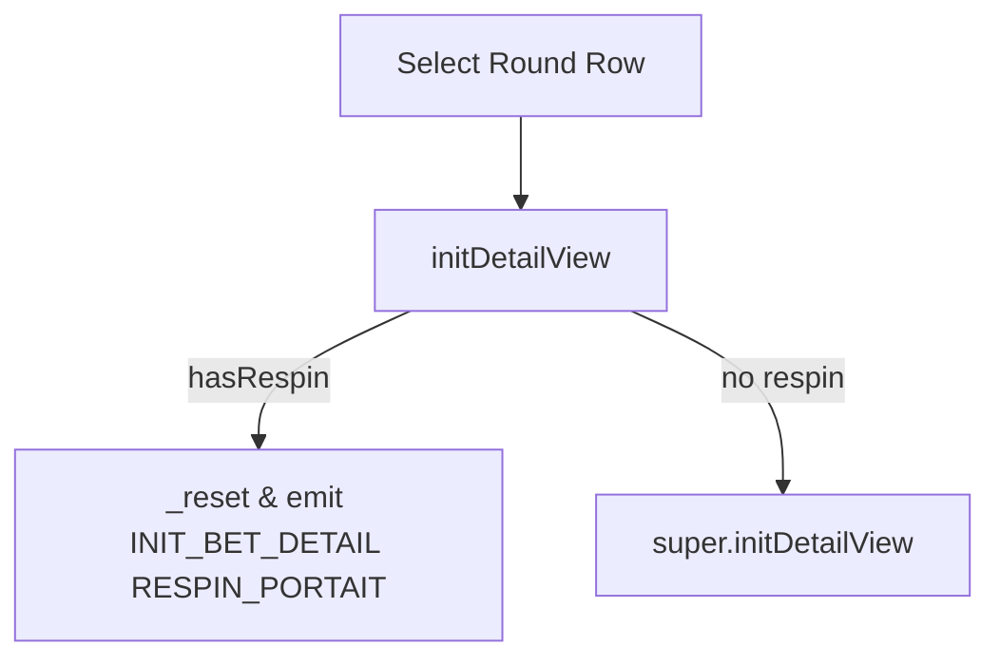

# 📖 `BetHistoryDetailPortrait.initDetailView()`

<!-- convention-summary-start -->
### BetHistoryDetailPortrait.initDetailView Method Summary

- **Core Architecture / Purpose**: Technical reference, API contract, and integration guide for BetHistoryDetailPortrait.initDetailView Method.
- **Key Mechanisms & Design**: Encapsulates core algorithms, event hooks, and performance optimizations within the slot framework runtime.
- **Domain Capabilities**: cc_slot_module, 05_methods
- **Scope & Code Paths**: `assets/cc-common/cc-slot-module/`
- **Related Docs**: [Master Index](../INDEX.md)
<!-- convention-summary-end -->


---

## 1. Method Overview & Signature

Initializes the round detail replay view with portrait-specific respin payload types.

```typescript
public initDetailView(data: any): void
```

---

## 2. Trigger Source & Execution Lifecycle

- **Invoker**: Called when player taps a historical round row in the main history list.

---

## 3. Detailed Algorithmic Breakdown

1. If `this.hasRespin` is `true`:
   - Calls `this._reset()` to clear previous replay buffers.
   - Dispatches `GameLogicUIEvents.INIT_BET_DETAIL` with payload `eno.BET_DEFAULT_HISTORY_TYPE.RESPIN_PORTAIT`.
2. Otherwise, calls `super.initDetailView(data)` for standard non-respin rounds.

---

## 4. Caller & Callee Execution Graph



---

## 5. Parameters & Return Value Specification

| Parameter | Type | Description |
| :--- | :--- | :--- |
| `data` | `any` | Detailed spin history record payload from server. |

---

## 6. Complete Source Code Implementation

```typescript
initDetailView(data: any): void {
	if (this.hasRespin) {
		this._reset();
		this.gameLogic.emit(GameLogicUIEvents.INIT_BET_DETAIL, data, eno.BET_DEFAULT_HISTORY_TYPE.RESPIN_PORTAIT);
	} else {
		super.initDetailView(data);
	}
}
```
