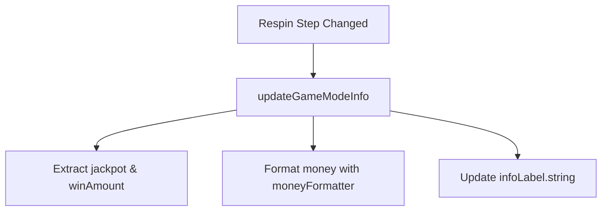

# 📖 `BetHistoryDetailPortrait.updateGameModeInfo()`

<!-- convention-summary-start -->
### BetHistoryDetailPortrait.updateGameModeInfo Method Summary

- **Core Architecture / Purpose**: Technical reference, API contract, and integration guide for BetHistoryDetailPortrait.updateGameModeInfo Method.
- **Key Mechanisms & Design**: Encapsulates core algorithms, event hooks, and performance optimizations within the slot framework runtime.
- **Domain Capabilities**: cc_slot_module, 05_methods
- **Scope & Code Paths**: `assets/cc-common/cc-slot-module/`
- **Related Docs**: [Master Index](../INDEX.md)
<!-- convention-summary-end -->


---

## 1. Method Overview & Signature

Formats and renders the replay step header and formatted cash win amount or jackpot tag.

```typescript
public updateGameModeInfo(data: any): void
```

---

## 2. Trigger Source & Execution Lifecycle

- **Invoker**: Triggered when advancing or stepping back through respin history steps.

---

## 3. Detailed Algorithmic Breakdown

1. Extracts `latestWinJackpotInfo` and `winAmount` from `data.customData`.
2. Reads current step data via `this.getCurrentData()`.
3. Formats header string: `isRespin ? name : gameMode`.
4. Formats money: appends ` + JACKPOT: ` with formatted sum if jackpot won, or `: ` with formatted `winAmount`.
5. Sets `this.infoLabel.string = text`.

---

## 4. Caller & Callee Execution Graph



---

## 5. Parameters & Return Value Specification

| Parameter | Type | Description |
| :--- | :--- | :--- |
| `data` | `any` | Step replay record containing customData and matrix snapshots. |

---

## 6. Complete Source Code Implementation

```typescript
updateGameModeInfo(data: any): void {
	const { latestWinJackpotInfo, winAmount } = data.customData;
	const currentData = this.getCurrentData();
	if (!currentData) {
		cc.warn('currentData is null');
		return;
	}

	const { isRespin, gameMode, name } = currentData;
	let text = isRespin ? `${name}` : `${gameMode}`;

	if (winAmount || latestWinJackpotInfo) {
		if (winAmount === 0 && !latestWinJackpotInfo) {
			return;
		}

		if (latestWinJackpotInfo) {
			const jpAmount = latestWinJackpotInfo[0] && latestWinJackpotInfo[0].jackpotAmount;
			text += " + JACKPOT: " + this.moneyFormatter.formatMoney(jpAmount + winAmount);
		} else {
			text += ": " + this.moneyFormatter.formatMoney(winAmount);
		}
	}
	this.infoLabel.string = text;
}
```
