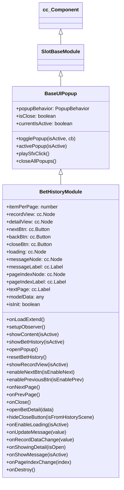

# 🏛️ BetHistoryModule Architecture & Core Role

<!-- convention-summary-start -->
### BetHistoryModule Architecture & Role Summary

- **Core Architecture / Purpose**: Technical reference, API contract, and integration guide for BetHistoryModule Architecture & Role.
- **Key Mechanisms & Design**: Encapsulates core algorithms, event hooks, and performance optimizations within the slot framework runtime.
- **Domain Capabilities**: cc_slot_module, 01_overview
- **Scope & Code Paths**: `assets/cc-common/cc-slot-module/`
- **Related Docs**: [Master Index](../INDEX.md)
<!-- convention-summary-end -->


The `BetHistoryModule` class is the central UI controller for the player's betting history in the Cocos Common (`cc-common`) Slot Framework SDK. It inherits from `BaseUIPopup` and is responsible for managing the top-level session overview list, paging navigation controls, loading overlays, and delegating detailed round replays to the child `BetHistoryDetailModule`.

---

## 1. Architectural Boundaries & System Role

`BetHistoryModule` operates at the boundary between presentation UI and game logic data models:
- **Presentation Layer**: Controls visibility of `recordView` (session list) and `detailView` (step replay).
- **Reactive Model Observer**: Binds to `BetHistoryData` in `gameLogic.getDataModel()` using the reactive `observer` utility to automatically respond to data mutations without manual polling.
- **Stand-Alone vs In-Game Modals**: Dynamically hides the close button (`closeBtn`) when embedded inside an external history scene (`isFromHistoryScene: true`).

---

## 2. Component Hierarchy & Scene Graph Placement

Canonical Node Path: `Canvas/Director/Popup/BetHistory`

```text
Canvas/Director/Popup/BetHistory (BetHistoryModule, FadePopupBehavior)
├── RecordView (cc.Node - Container for BetCellHistory items)
├── DetailView (cc.Node - Container for BetHistoryDetailModule)
├── Header
│   ├── Title (cc.Label / cc.Sprite)
│   └── CloseButton (cc.Button)
├── PaginationGroup
│   ├── BackBtn (cc.Button)
│   ├── NextBtn (cc.Button)
│   └── PageIndexNode (cc.Node)
│       └── PageIndexLabel (cc.Label)
├── Loading (cc.Node - Spinner)
└── MessageNode (cc.Node - Error/Empty alert)
    └── MessageLabel (cc.Label)
```

---

## 3. Inheritance Diagram


