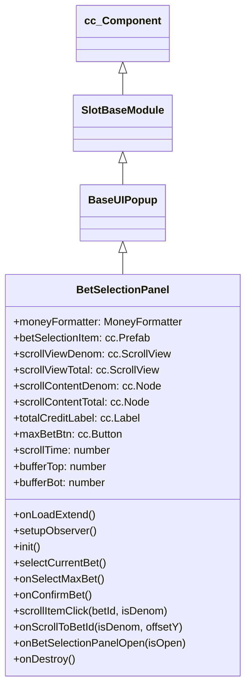

# 🏛️ BetSelectionPanel Architecture & Role

<!-- convention-summary-start -->
### BetSelectionPanel Architecture & Role Summary

- **Core Architecture / Purpose**: Technical reference, API contract, and integration guide for BetSelectionPanel Architecture & Role.
- **Key Mechanisms & Design**: Encapsulates core algorithms, event hooks, and performance optimizations within the slot framework runtime.
- **Domain Capabilities**: cc_slot_module, 01_overview
- **Scope & Code Paths**: `assets/cc-common/cc-slot-module/`
- **Related Docs**: [Master Index](../INDEX.md)
<!-- convention-summary-end -->


`BetSelectionPanel` is the dual-wheel interactive bet selector modal in the `cc-common` Slot Framework SDK. Inheriting from `BaseUIPopup`, it features synchronized twin ScrollViews—one for Bet Denominations (`scrollViewDenom`) and one for Total Bet amounts (`scrollViewTotal`)—with top/bottom buffer padding, snap-to-closest item physics, mouse wheel support, and animated selection tweens.

---

## 1. Architectural Role

- **Dual Synchronized ScrollViews**: Keeps `scrollViewDenom` and `scrollViewTotal` in lockstep when scrolling or clicking either column.
- **Snap-to-Grid Math**: Calculates `findClosestItemIndex` and `calculateOffsetY` based on item heights and buffer rows (`bufferTop`, `bufferBot`).
- **Reactive Model Observer**: Watches `BetData` for `totalCredit`, `betLineNumber`, and `mainBets`, and observes `UIManagerData.isBetSelectionPanelOpen`.
- **Ante/Extra Bet Integration**: Formats full composite bet key with `getBetId()` combining `currentBetId` and `extraBetKey`.

---

## 2. Component Hierarchy

Canonical Node Path: `Canvas/Director/Popup/BetSelectionPanel`

```text
BetSelectionPanel (BetSelectionPanel, FadePopupBehavior)
├── Background (cc.Sprite)
├── Header
│   ├── TotalCreditLabel (cc.Label)
│   └── MaxBetBtn (cc.Button)
├── WheelsContainer
│   ├── DenomColumn
│   │   └── ScrollViewDenom (cc.ScrollView)
│   │       └── ScrollContentDenom (cc.Node + cc.Layout)
│   └── TotalColumn
│       └── ScrollViewTotal (cc.ScrollView)
│           └── ScrollContentTotal (cc.Node + cc.Layout)
└── Footer
    ├── ConfirmBtn (cc.Button)
    └── CloseBtn (cc.Button)
```

---

## 3. Inheritance Diagram


