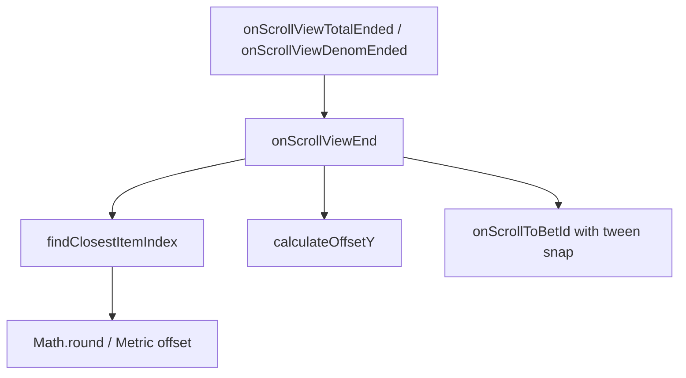

# 📖 `BetSelectionPanel.findClosestItemIndex()`

<!-- convention-summary-start -->
### BetSelectionPanel.findClosestItemIndex Method Summary

- **Core Architecture / Purpose**: Technical reference, API contract, and integration guide for BetSelectionPanel.findClosestItemIndex Method.
- **Key Mechanisms & Design**: Encapsulates core algorithms, event hooks, and performance optimizations within the slot framework runtime.
- **Domain Capabilities**: cc_slot_module, 05_methods
- **Scope & Code Paths**: `assets/cc-common/cc-slot-module/`
- **Related Docs**: [Master Index](../INDEX.md)
<!-- convention-summary-end -->


---

## 1. Method Overview & Signature

Calculates the nearest discrete bet item row index from an arbitrary continuous vertical scroll offset, compensating for top buffer padding.

```typescript
public findClosestItemIndex(scrollOffsetY: number): number
```

---

## 2. Trigger Source & Execution Context

- **Caller / Invoker**: Invoked by `onScrollViewEnd(isDenom)` immediately when the player completes a touch drag gesture, mouse wheel flick, or when inertia scrolling terminates.
- **Lifecycle Moment**: State settlement during idle bet selection phase.

---

## 3. Mathematical Formula & Algorithmic Breakdown

The dual-wheel bet selector uses empty buffer items at the top of the scroll content to ensure that the first valid bet option can align with the center selection window. The calculation follows these exact mathematical steps:

1. **Item Metric Extraction**: Reads `itemHeight = this.betDenomItems[0].node.height` (typically 60px - 80px).
2. **Buffer Compensation**: Computes the top buffer pixel offset:
   $$\text{bufferOffset} = (\text{bufferTop} - 1) \times \text{itemHeight}$$
3. **Net Scroll Offset**: Subtracts the buffer offset from the raw ScrollView offset:
   $$\text{actualScrollOffset} = \text{scrollOffsetY} - \text{bufferOffset}$$
4. **Discretization via Rounding**: Converts the continuous pixel value into the closest integer index using `Math.round()`:
   $$\text{closestIndex} = \text{round}\left(\frac{\text{actualScrollOffset}}{\text{itemHeight}}\right)$$
5. **Boundary Safeguard**: Returns `closestIndex` which is subsequently validated against `0 \le \text{index} < \text{showItems}`.

---

## 4. Caller & Callee Graph



---

## 5. Parameters & Return Value Specification

| Parameter | Type | Description |
| :--- | :--- | :--- |
| `scrollOffsetY` | `number` | The raw Y-axis pixel offset returned by `this.scrollView.getScrollOffset().y`. |

| Return Type | Value Range | Description |
| :--- | :--- | :--- |
| `number` | `0 .. showItems - 1` | The zero-based index of the closest bet option in `totalBetItems` / `betDenomItems`. |

---

## 6. Complete Source Code Implementation

```typescript
findClosestItemIndex(scrollOffsetY: number): number {
    const itemHeight = this.betDenomItems[0].node.height;
    const bufferOffset = (this.bufferTop - 1) * itemHeight;
    const actualScrollOffset = scrollOffsetY - bufferOffset;
    let closestIndex = Math.round(actualScrollOffset / itemHeight);
    return closestIndex;
}
```
