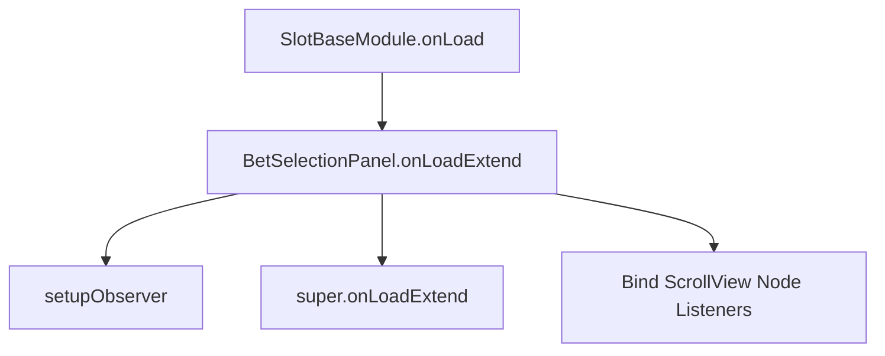

# 📖 `BetSelectionPanel.onLoadExtend()`

<!-- convention-summary-start -->
### BetSelectionPanel.onLoadExtend Method Summary

- **Core Architecture / Purpose**: Technical reference, API contract, and integration guide for BetSelectionPanel.onLoadExtend Method.
- **Key Mechanisms & Design**: Encapsulates core algorithms, event hooks, and performance optimizations within the slot framework runtime.
- **Domain Capabilities**: cc_slot_module, 05_methods
- **Scope & Code Paths**: `assets/cc-common/cc-slot-module/`
- **Related Docs**: [Master Index](../INDEX.md)
<!-- convention-summary-end -->


---

## 1. Method Overview & Signature

Initializes node listeners for touch, mouse wheel, and scroll completion events across both `scrollViewDenom` and `scrollViewTotal`, records initial coordinate anchors, and establishes reactive data model observers.

```typescript
public onLoadExtend(): void
```

---

## 2. Trigger Source & Execution Lifecycle

- **Invoker**: Called by `SlotBaseModule.onLoad()` during the node activation lifecycle before `start()`.
- **Phase**: Bootstrap and initialization.

---

## 3. Detailed Algorithmic Breakdown

1. **Denomination ScrollView Event Wiring**:
   - Subscribes `scroll-ended` to `onScrollViewDenomEnded`.
   - Subscribes `touch-up`, `TOUCH_END`, and `TOUCH_CANCEL` to `touchUpViewDenom`.
   - Subscribes `MOUSE_WHEEL` to `onMouseWheel` for desktop browser testing.
2. **Total Bet ScrollView Event Wiring**:
   - Mirrors identical event bindings onto `scrollViewTotal`.
3. **Anchor Recording**: Caches `this.startPosY = this.scrollContentTotal.position.y` for delta coordinate calculations.
4. **Observer Setup**: Calls `this.setupObserver()` to begin watching `BetData` and `UIManagerData`.
5. **Superclass Propagation**: Calls `super.onLoadExtend()` to configure base popup behaviors.

---

## 4. Caller & Callee Execution Graph



---

## 5. Parameters & Return Value Specification

| Parameter | Type | Description |
| :--- | :--- | :--- |
| None | `void` | Standard component lifecycle method. |

| Return Type | Description |
| :--- | :--- |
| `void` | None. |

---

## 6. Complete Source Code Implementation

```typescript
onLoadExtend(): void {
	this.scrollViewDenom.node.on('scroll-ended', this.onScrollViewDenomEnded, this);
	this.scrollViewDenom.node.on('touch-up', this.touchUpViewDenom, this);
	this.scrollViewDenom.node.on(Node.EventType.TOUCH_END, this.touchUpViewDenom, this);
	this.scrollViewDenom.node.on(Node.EventType.TOUCH_CANCEL, this.touchUpViewDenom, this);
	this.scrollViewDenom.node.on(Node.EventType.MOUSE_WHEEL, this.onMouseWheel, this);

	this.scrollViewTotal.node.on('scroll-ended', this.onScrollViewTotalEnded, this);
	this.scrollViewTotal.node.on('touch-up', this.touchUpViewTotal, this);
	this.scrollViewTotal.node.on(Node.EventType.TOUCH_END, this.touchUpViewTotal, this);
	this.scrollViewTotal.node.on(Node.EventType.TOUCH_CANCEL, this.touchUpViewTotal, this);
	this.scrollViewTotal.node.on(Node.EventType.MOUSE_WHEEL, this.onMouseWheel, this);

	this.startPosY = this.scrollContentTotal.position.y;
	this.setupObserver();
	super.onLoadExtend();
}
```
