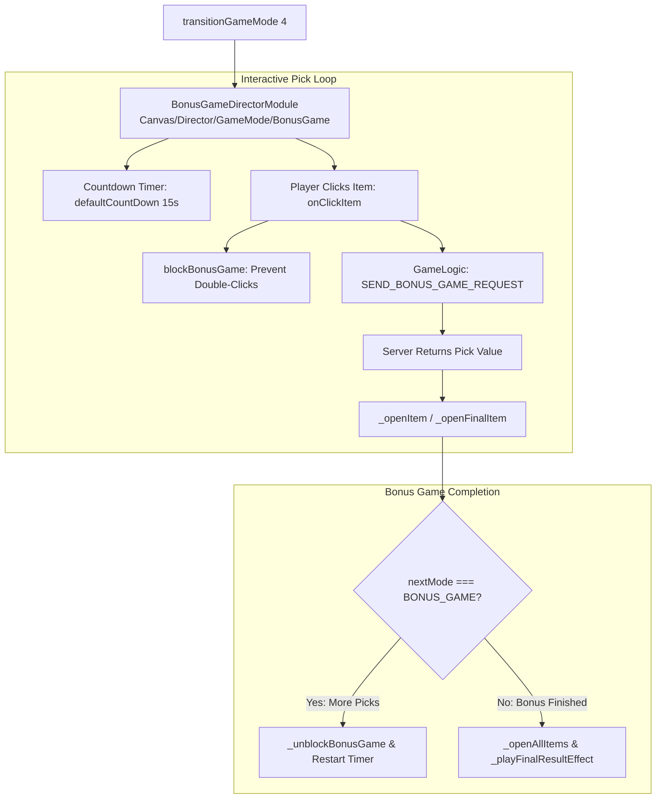

# 🏛️ BonusGameDirectorModule Interactive Pick Feature Architecture

<!-- convention-summary-start -->
### BonusGameDirectorModule Interactive Pick Feature Architecture Summary

- **Core Architecture / Purpose**: Technical reference, API contract, and integration guide for BonusGameDirectorModule Interactive Pick Feature Architecture.
- **Key Mechanisms & Design**: Encapsulates core algorithms, event hooks, and performance optimizations within the slot framework runtime.
- **Domain Capabilities**: cc_slot_module, 01_overview
- **Scope & Code Paths**: `assets/cc-common/cc-slot-module/GameMode/BonusGame/BonusGameDirectorModule.ts`
- **Related Docs**: [Master Index](../INDEX.md)
<!-- convention-summary-end -->

## 1. Executive Summary & Purpose

`BonusGameDirectorModule` (`assets/cc-common/cc-slot-module/GameMode/BonusGame/BonusGameDirectorModule.ts`) is the **Interactive Pick-and-Click / Mini-Game Director** in the `cc-common` Slot SDK.

Extending `GameModeDirectorModule`, it manages the interactive player selection flow in Bonus Game features (`GAME_MODE_ENUM.BONUS_GAME`). It coordinates countdown timers (`defaultCountDown = 15s`), triggers automatic selection on timeout (`AUTO_PLAY_BONUS_GAME`), validates against duplicate box picks (`openedBoxes`), reveals individual item rewards, uncovers remaining items on game completion, and launches final Jackpot or Total Win celebrations.

---

## 2. Core Responsibilities

1. **Interactive Click & Validation Handling (`onClickItem`)**: Intercepts `CLICK_ITEM`, records picked IDs in `openedBoxes`, blocks further clicks during network transit, and emits `SEND_BONUS_GAME_REQUEST`.
2. **Auto-Pick Timeout Management (`startCountDown`, `_runAutoTrigger`)**: Decrements countdown timer every 1s; fires `AUTO_PLAY_BONUS_GAME` when timer reaches 0.
3. **Progressive Item Unveiling (`_openItem`, `_openFinalItem`, `_openAllItems`)**: Emits scoped events to animate individual treasure chest / vase openings and reveal unselected items at the end.
4. **Session Reconnection State Recovery (`_resumeOpenedBoxes`)**: Restores previously opened item states upon reconnection.
