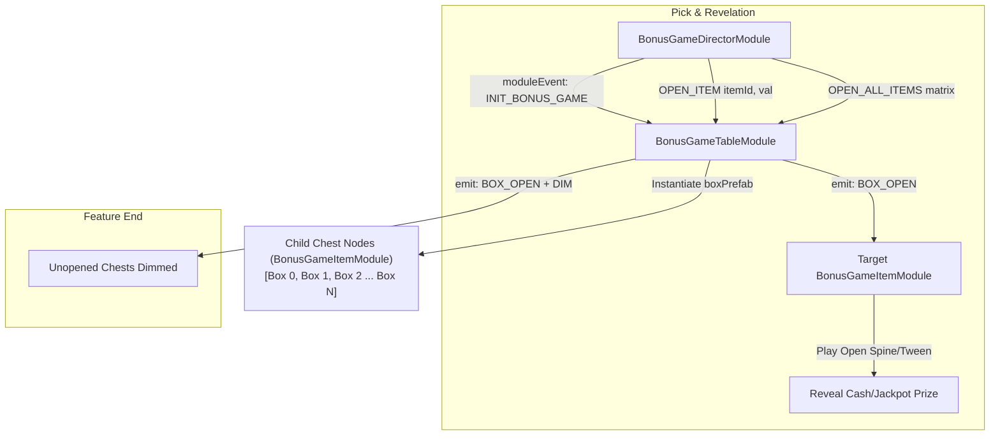

# 🏛️ BonusGameTableModule Interactive Pick Grid Orchestrator Architecture

<!-- convention-summary-start -->
### BonusGameTableModule Interactive Pick Grid Orchestrator Architecture Summary

- **Core Architecture / Purpose**: Technical reference, API contract, and integration guide for BonusGameTableModule Interactive Pick Grid Orchestrator Architecture.
- **Key Mechanisms & Design**: Encapsulates core algorithms, event hooks, and performance optimizations within the slot framework runtime.
- **Domain Capabilities**: cc_slot_module, 01_overview
- **Scope & Code Paths**: `assets/cc-common/cc-slot-module/GameMode/BonusGame/BonusGameTableModule.ts`
- **Related Docs**: [Master Index](../INDEX.md)
<!-- convention-summary-end -->

## 1. Executive Summary & Purpose

`BonusGameTableModule` (`assets/cc-common/cc-slot-module/GameMode/BonusGame/BonusGameTableModule.ts`) is the **Interactive Grid & Item Matrix Manager** for Pick Mini-Games.

Extending `SlotBaseModule`, it dynamically instantiates the matrix of clickable treasure chests/boxes (`boxPrefab`) based on `BonusTableConfig` dimensions (`COL_NUMBER` × `ROW_NUMBER`). It routes scoped module events (`INIT_BONUS_GAME`, `OPEN_ITEM`, `OPEN_FINAL_ITEM`, `OPEN_ALL_ITEMS`) to individual child `BonusGameItemModule` instances, handles timeout auto-clicks (`autoClick`), and uncovers remaining unopened items with dimmed grayscale styling when the feature concludes.

---

## 2. Core Responsibilities

1. **Dynamic Grid Instantiation (`initBoxes`)**: Calculates centering offsets (`startX`, `startY`) and instantiates `COL_NUMBER * ROW_NUMBER` chest nodes from `boxPrefab`.
2. **Interactive Item State Management**: Tracks `listBoxes` array and routes open/dim/undim/disable commands to individual item nodes.
3. **Auto-Selection Execution (`autoClick`)**: Chooses an unopened chest index at random when the player's countdown timer expires.
4. **End-of-Round Matrix Reveal (`openAllBoxes`)**: Reconstructs the remaining unpicked prize pool and reveals all unopened chests with `DIM` filters.
