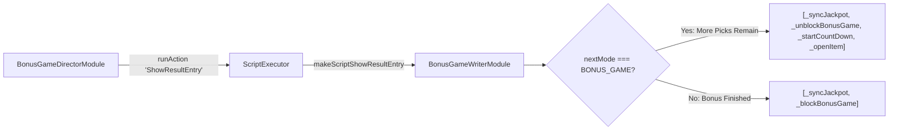

# 🏛️ BonusGameWriterModule Interactive Pick Script Generator Architecture

<!-- convention-summary-start -->
### BonusGameWriterModule Interactive Pick Script Generator Architecture Summary

- **Core Architecture / Purpose**: Technical reference, API contract, and integration guide for BonusGameWriterModule Interactive Pick Script Generator Architecture.
- **Key Mechanisms & Design**: Encapsulates core algorithms, event hooks, and performance optimizations within the slot framework runtime.
- **Domain Capabilities**: cc_slot_module, 01_overview
- **Scope & Code Paths**: `assets/cc-common/cc-slot-module/GameMode/BonusGame/BonusGameWriterModule.ts`
- **Related Docs**: [Master Index](../INDEX.md)
<!-- convention-summary-end -->

## 1. Executive Summary & Purpose

`BonusGameWriterModule` (`assets/cc-common/cc-slot-module/GameMode/BonusGame/BonusGameWriterModule.ts`) is the **Declarative Action Script Generator for Interactive Bonus Features**.

Extending `GameModeWriterModule`, it compiles the step pipeline for player pick interactions (`makeScriptShowResultEntry`) and terminal prize revelations (`makeScriptShowResultFinal`). It unblocks chests between picks and triggers the reveal of unselected items (`_openAllItems`) when the bonus concludes.

---

## 2. Core Responsibilities

1. **Pick Step Pipeline (`makeScriptShowResultEntry`)**: Emits `_openItem`, restarts countdown timer, and unblocks player touches.
2. **Feature Finalization Pipeline (`makeScriptShowResultFinal`)**: Compiles `_stopCountDown`, `_openFinalItem`, `_openAllItems`, `_playFinalResultEffect`, and `_clearCurrentBonusGameData`.
3. **Session Reconnection Pipeline (`makeScriptResumeGameMode`)**: Compiles `_blockBonusGame`, `_resumeOpenedBoxes`, `_unblockBonusGame`, and `_startCountDown`.
