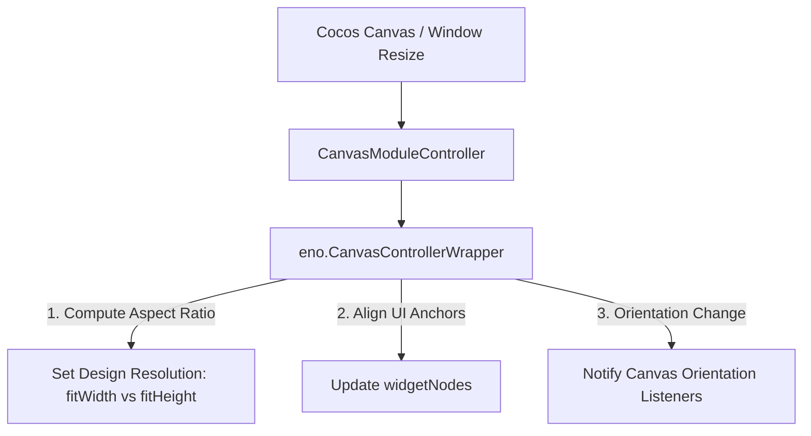

# 🏛️ CanvasModuleController Architectural Role & Viewport Adapter

<!-- convention-summary-start -->
### CanvasModuleController Architectural Role & Viewport Adapter Summary

- **Core Architecture / Purpose**: Technical reference, API contract, and integration guide for CanvasModuleController Architectural Role & Viewport Adapter.
- **Key Mechanisms & Design**: Encapsulates core algorithms, event hooks, and performance optimizations within the slot framework runtime.
- **Domain Capabilities**: cc_slot_module, 01_overview
- **Scope & Code Paths**: `assets/cc-common/cc-slot-module/`
- **Related Docs**: [Master Index](../INDEX.md)
<!-- convention-summary-end -->

---

## 1. Architectural Mission

`CanvasModuleController` is the **Master Responsive Canvas Resolution & Viewport Controller** mounted directly on the root `Canvas` node. It wraps `eno.CanvasControllerWrapper` to manage:
- Dynamic design resolution calculation based on device screen aspect ratio ($W/H$).
- Auto-orientation detection (switching between landscape and portrait adaptation policies).
- Widget alignment updates (`widgetNodes`) across window resizing events.
- Safe Area insets handling for notched mobile devices (iPhone X / Dynamic Island).

