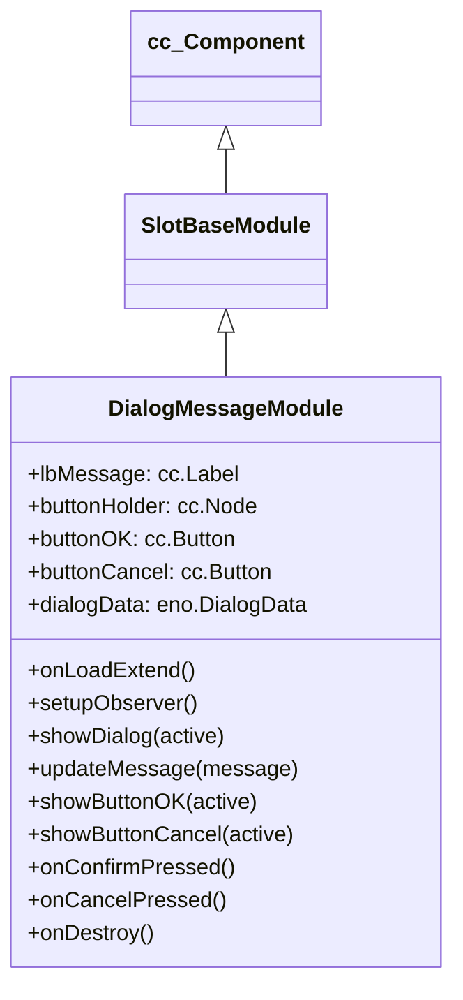

# 🏛️ DialogMessageModule Architecture & Role

<!-- convention-summary-start -->
### DialogMessageModule Architecture & Role Summary

- **Core Architecture / Purpose**: Technical reference, API contract, and integration guide for DialogMessageModule Architecture & Role.
- **Key Mechanisms & Design**: Encapsulates core algorithms, event hooks, and performance optimizations within the slot framework runtime.
- **Domain Capabilities**: cc_slot_module, 01_overview
- **Scope & Code Paths**: `assets/cc-common/cc-slot-module/`
- **Related Docs**: [Master Index](../INDEX.md)
<!-- convention-summary-end -->


`DialogMessageModule` is the system-level alert dialog controller in the `cc-common` Slot Framework SDK. Mounted directly on `Canvas/Director/DialogMessage`, it displays unskippable modal alerts for network disconnects, server maintenance, session kicks, and critical confirmation prompts.

---

## 1. Architectural Boundaries & System Role

- **System Alert Gatekeeper**: Observes `DialogData` for `active`, `message`, `isOkBtnActive`, and `isCancelBtnActive`.
- **Action Callbacks**: Emits `ON_ACTION_OK` and `ON_ACTION_CANCEL` to `GameLogicUIEvents` upon player confirmation.
- **Topmost Z-Index Layer**: Renders above all gameplay reels, popups, and cutscenes to guarantee player awareness during network dropouts.

---

## 2. Component Hierarchy

Canonical Node Path: `Canvas/Director/DialogMessage`

```text
Canvas/Director/DialogMessage (DialogMessageModule)
├── DimBackdrop (cc.Sprite - Fullscreen touch blocker)
├── DialogWindow (cc.Node)
│   ├── LbMessage (cc.Label - Alert description text)
│   └── ButtonHolder (cc.Node)
│       ├── ButtonOK (cc.Button - Action confirm)
│       └── ButtonCancel (cc.Button - Action dismiss)
```

---

## 3. Inheritance Diagram


