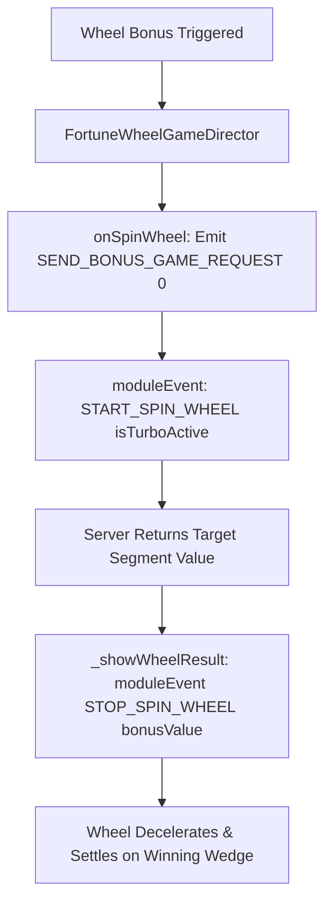

# 🏛️ FortuneWheelGameDirector Wheel Mini-Game Orchestrator Architecture

<!-- convention-summary-start -->
### FortuneWheelGameDirector Wheel Mini-Game Orchestrator Architecture Summary

- **Core Architecture / Purpose**: Technical reference, API contract, and integration guide for FortuneWheelGameDirector Wheel Mini-Game Orchestrator Architecture.
- **Key Mechanisms & Design**: Encapsulates core algorithms, event hooks, and performance optimizations within the slot framework runtime.
- **Domain Capabilities**: cc_slot_module, 01_overview
- **Scope & Code Paths**: `assets/cc-common/cc-slot-module/GameMode/FortuneWheelGame/Scripts/Director/FortuneWheelGameDirector.ts`
- **Related Docs**: [Master Index](../INDEX.md)
<!-- convention-summary-end -->

## 1. Executive Summary & Purpose

`FortuneWheelGameDirector` (`assets/cc-common/cc-slot-module/GameMode/FortuneWheelGame/Scripts/Director/FortuneWheelGameDirector.ts`) is the **Wheel of Fortune Mini-Game Director**.

Extending `BonusGameDirectorModule`, it orchestrates circular wheel spin interactions (`ON_SPIN_WHEEL`). It emits backend spin requests (`SEND_BONUS_GAME_REQUEST`), coordinates deceleration physics via `FortuneWheelModule` (`START_SPIN_WHEEL`, `STOP_SPIN_WHEEL`), supports fast-stop skipping (`_fastStopWheel`), handles timeout auto-spins (`_runAutoTrigger`), and settles final wheel rewards.

---

## 2. Core Responsibilities

1. **Wheel Spin Initiation (`onSpinWheel`)**: Dispatches backend request, triggers wheel acceleration, blocks further clicks, and stops countdown timer.
2. **Result Settlement (`_showWheelResult`)**: Emits `STOP_SPIN_WHEEL` with target `bonusValue` to settle the wheel pointer on the target wedge.
3. **Fast Stop Acceleration (`_fastStopWheel`)**: Accelerates wheel deceleration when player touches screen during rotation.
4. **Auto-Spin Support (`_runAutoTrigger`, `playAutoClick`)**: Triggers `onSpinWheel()` automatically on countdown expiry.
