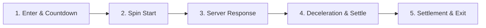

# 🔄 FortuneWheelGameDirector Spin & Interaction Phase Breakdown

<!-- convention-summary-start -->
### FortuneWheelGameDirector Spin & Interaction Phase Breakdown Summary

- **Core Architecture / Purpose**: Defines network protocol, socket packet lifecycle, state persistence, and error handling for FortuneWheelGameDirector Spin & Interaction Phase Breakdown.
- **Key Mechanisms & Design**: Handles WebSocket frame dispatch, acknowledgment confirmation, state resume, and resilient synchronization between client DataStore and Backend Gateway.
- **Domain Capabilities**: cc_slot_module, 02_game_flow
- **Scope & Code Paths**: `assets/cc-common/cc-slot-module/`
- **Related Docs**: [Master Index](../INDEX.md)
<!-- convention-summary-end -->

---

## 1. Overview of Wheel Game Flow

`FortuneWheelGameDirector` coordinates the lifecycle of the Wheel of Fortune bonus feature through 5 clear interaction phases:

---

## 2. Phase 1: Mode Enter & Countdown
* **Trigger**: `enter()` is called when the wheel bonus mode activates.
* **Actions**:
  1. `initBonusGame()` initializes components once.
  2. `resetBonusGame()` emits `"RESET_WHEEL"` on `moduleEvent`.
  3. `blockBonusGame()` prepares UI interaction.
  4. BGM transitions to bonus music (`playGameModeBGM()`).
  5. Starts countdown timer (`startCountDown(defaultCountDown)`).

---

## 3. Phase 2: Spin Initiation (Manual or Auto)
* **Trigger**: Player taps "Spin Wheel" button (emitting `"ON_SPIN_WHEEL"`) or countdown expires (`_runAutoTrigger()`).
* **Actions**:
  1. Calls `onSpinWheel()`.
  2. Dispatches `GameLogicUIEvents.SEND_BONUS_GAME_REQUEST` to backend socket.
  3. Emits `this.moduleEvent.emit("START_SPIN_WHEEL", isTurboActive)`.
  4. Blocks further user input via `blockBonusGame()`.
  5. Cancels countdown timer (`stopCountDown()`).

---

## 4. Phase 3: Server Response & Result Presentation
* **Trigger**: Backend sends bonus wheel packet with selected prize index.
* **Actions**:
  1. Writer / Director receives packet and calls `_showWheelResult(bonusValue)`.
  2. Emits `"STOP_SPIN_WHEEL"` with `bonusValue` to `FortuneWheelModule`.
  3. Wheel initiates deceleration curve targeting the calculated sector.

---

## 5. Phase 4: Fast Stop & Skipping (Optional)
* **Trigger**: Player taps screen while wheel is in continuous spin.
* **Actions**:
  1. Calls `_fastStopWheel()`.
  2. Emits `"FAST_STOP_WHEEL"` across `moduleEvent`.
  3. `FortuneWheelModule` cuts deceleration duration to fast-stop curve.

---

## 6. Phase 5: Settle & Mode Exit
* **Trigger**: Wheel stops completely on target sector and displays prize celebration.
* **Actions**:
  1. Shows win amount celebration / popup cutscene.
  2. Calls mode transition to return to base game or award free spins.
