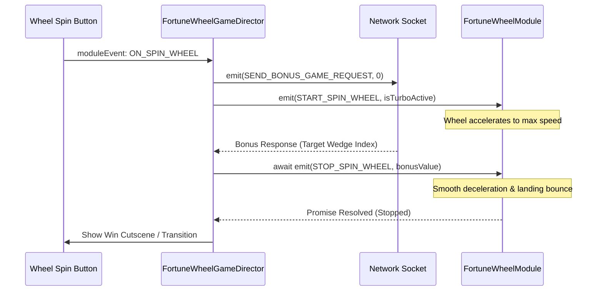

# ⏱️ FortuneWheelGameDirector Timing & Execution Matrix

<!-- convention-summary-start -->
### FortuneWheelGameDirector Timing & Execution Matrix Summary

- **Core Architecture / Purpose**: Defines network protocol, socket packet lifecycle, state persistence, and error handling for FortuneWheelGameDirector Timing & Execution Matrix.
- **Key Mechanisms & Design**: Handles WebSocket frame dispatch, acknowledgment confirmation, state resume, and resilient synchronization between client DataStore and Backend Gateway.
- **Domain Capabilities**: cc_slot_module, 02_game_flow
- **Scope & Code Paths**: `assets/cc-common/cc-slot-module/`
- **Related Docs**: [Master Index](../INDEX.md)
<!-- convention-summary-end -->

---

## 1. Lifecycle & Method Execution Timing

| Phase | Trigger Event | Method Invoked | Target Subsystem / Event | Failure Impact If Desynced |
| :--- | :--- | :--- | :--- | :--- |
| **Awake / Setup** | Scene Load | `onExtendedLoad()` | Registers `ON_SPIN_WHEEL` | Spin button clicks ignored. |
| **Enter Mode** | Director Transition | `enter()` ➔ `startBonusGame()` | `RESET_WHEEL`, countdown start | Wheel visual angle remains at previous position. |
| **Spin Trigger** | UI Click / Timer Expiry | `onSpinWheel()` / `_runAutoTrigger()` | `SEND_BONUS_GAME_REQUEST`, `START_SPIN_WHEEL` | Wheel fails to spin, socket request not sent. |
| **Receive Result** | Network Response | `_showWheelResult(bonusValue)` | `STOP_SPIN_WHEEL` | Wheel spins indefinitely without stopping. |
| **Fast Stop** | Screen Tap during spin | `_fastStopWheel()` | `FAST_STOP_WHEEL` | Wheel deceleration cannot be accelerated. |
| **Reset** | Round complete / Re-entry | `resetBonusGame()` | `RESET_WHEEL` | Previous wheel result stays visible. |

---

## 2. Asynchronous Promise Chaining

