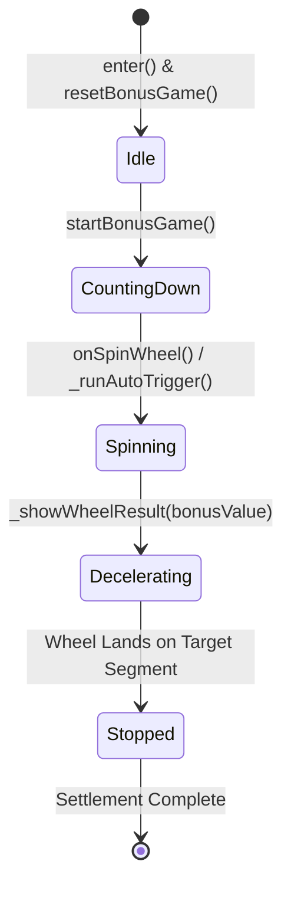

# 📊 FortuneWheelGameDirector Runtime State Variables

<!-- convention-summary-start -->
### FortuneWheelGameDirector Runtime State Variables Summary

- **Core Architecture / Purpose**: Technical reference, API contract, and integration guide for FortuneWheelGameDirector Runtime State Variables.
- **Key Mechanisms & Design**: Encapsulates core algorithms, event hooks, and performance optimizations within the slot framework runtime.
- **Domain Capabilities**: cc_slot_module, 04_properties_and_state
- **Scope & Code Paths**: `assets/cc-common/cc-slot-module/`
- **Related Docs**: [Master Index](../INDEX.md)
<!-- convention-summary-end -->

---

## 1. Runtime State Variables Dictionary

| Variable Name | Type | Default Value | Mutation Moment | Purpose & Guard Role |
| :--- | :--- | :--- | :--- | :--- |
| `isInit` | `boolean` | `false` | Set to `true` in `initBonusGame()`. | Prevents duplicate event binding and duplicate component initialization. |
| `isAutoOpen` | `boolean` | `false` | Set to `true` in `_runAutoTrigger()`. | Tracks whether current spin was triggered via player timeout. |
| `countdownTime` | `number` | `0` | Initialized to `defaultCountDown` in `startCountDown()`. | Tracks remaining seconds before auto-spin fires. |
| `_repeatCountDown` | `any` | `null` | Assigned periodic interval schedule handle. | Cleared via `stopCountDown()` when spin begins. |

---

## 2. State Transition Lifecycle

