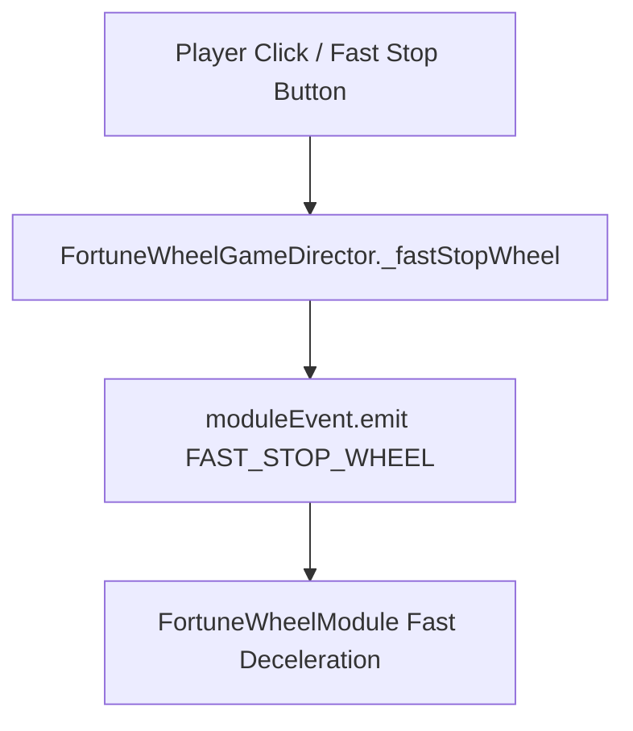

# `FortuneWheelGameDirector._fastStopWheel(): Promise<void>`

<!-- convention-summary-start -->
### FortuneWheelGameDirector._fastStopWheel() Method Specification Summary

- **Core Architecture / Purpose**: Technical reference, API contract, and integration guide for FortuneWheelGameDirector._fastStopWheel() Method Specification.
- **Key Mechanisms & Design**: Encapsulates core algorithms, event hooks, and performance optimizations within the slot framework runtime.
- **Domain Capabilities**: cc_slot_module, 05_methods
- **Scope & Code Paths**: `assets/cc-common/cc-slot-module/`
- **Related Docs**: [Master Index](../INDEX.md)
<!-- convention-summary-end -->


---

## 1. Method Signature
```typescript
public _fastStopWheel(): Promise<void>
```

---

## 2. Trigger Source & Lifecycle
* **Invoker**: Called when player clicks the screen / Stop button during active wheel rotation, or via test interface `FortuneWheelGameTest.onFastButtonClick()`.
* **Execution Flow**: Triggers fast deceleration mode on `FortuneWheelModule`.

---

## 3. Detailed Algorithmic Execution Logic
1. **Emits Fast Stop Request**: Dispatches `this.moduleEvent.emit("FAST_STOP_WHEEL")` across the scoped event bus.
2. **Returns Promise Chain**: Returns the resulting Promise so callers can track immediate deceleration completion.

---

## 4. Caller & Callee Relationship


---

## 5. Un-truncated Source Code Implementation
```typescript
_fastStopWheel(): Promise<void> {
	return this.moduleEvent.emit("FAST_STOP_WHEEL");
}
```
