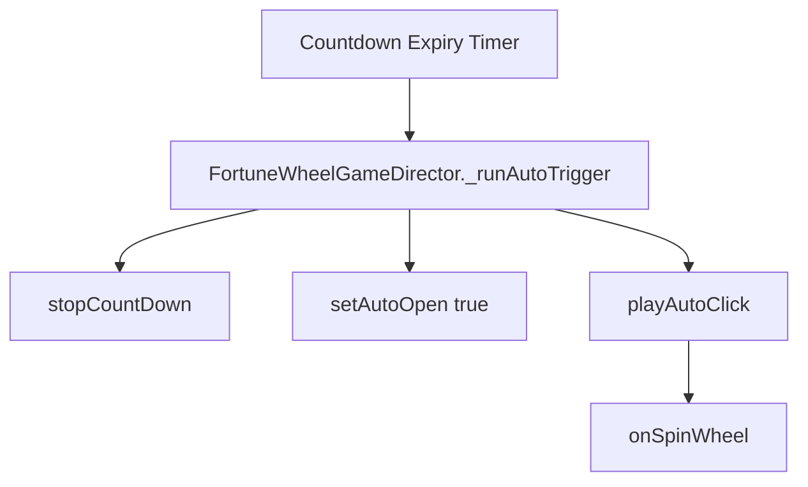

# `FortuneWheelGameDirector._runAutoTrigger(): void`

<!-- convention-summary-start -->
### FortuneWheelGameDirector._runAutoTrigger() Method Specification Summary

- **Core Architecture / Purpose**: Technical reference, API contract, and integration guide for FortuneWheelGameDirector._runAutoTrigger() Method Specification.
- **Key Mechanisms & Design**: Encapsulates core algorithms, event hooks, and performance optimizations within the slot framework runtime.
- **Domain Capabilities**: cc_slot_module, 05_methods
- **Scope & Code Paths**: `assets/cc-common/cc-slot-module/`
- **Related Docs**: [Master Index](../INDEX.md)
<!-- convention-summary-end -->


---

## 1. Method Signature
```typescript
public _runAutoTrigger(): void
```

---

## 2. Trigger Source & Lifecycle
* **Invoker**: Called by `BonusGameDirectorModule` countdown timer expiry mechanism when the player does not manually spin the wheel within `defaultCountDown` seconds (e.g. 15s).
* **Purpose**: Enforces auto-selection / auto-spin to prevent player stall.

---

## 3. Detailed Algorithmic Execution Logic
1. **Halts Active Countdown**: Invokes `this.stopCountDown()` to cancel any pending timer intervals.
2. **Flags Auto Open State**: Calls `this.setAutoOpen(true)` on `BonusGameDirectorModule`.
3. **Executes Auto Spin**: Invokes `this.playAutoClick()`, which triggers `this.onSpinWheel()`.

---

## 4. Caller & Callee Relationship


---

## 5. Un-truncated Source Code Implementation
```typescript
_runAutoTrigger(): void {
	this.stopCountDown();
	this.setAutoOpen(true);
	this.playAutoClick();
}
```
