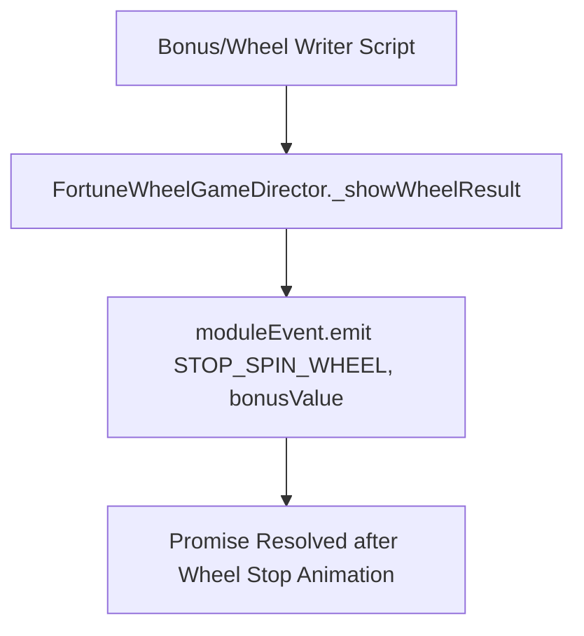

# `FortuneWheelGameDirector._showWheelResult(bonusValue: number): Promise<void>`

<!-- convention-summary-start -->
### FortuneWheelGameDirector._showWheelResult() Method Specification Summary

- **Core Architecture / Purpose**: Technical reference, API contract, and integration guide for FortuneWheelGameDirector._showWheelResult() Method Specification.
- **Key Mechanisms & Design**: Encapsulates core algorithms, event hooks, and performance optimizations within the slot framework runtime.
- **Domain Capabilities**: cc_slot_module, 05_methods
- **Scope & Code Paths**: `assets/cc-common/cc-slot-module/`
- **Related Docs**: [Master Index](../INDEX.md)
<!-- convention-summary-end -->


---

## 1. Method Signature
```typescript
public _showWheelResult(bonusValue: number): Promise<void>
```

---

## 2. Trigger Source & Lifecycle
* **Invoker**: Called by `FortuneWheelWriterModule` / `GameModeWriterModule` script action or test controller `FortuneWheelGameTest` when the backend returns the bonus game result payload containing the target wheel slice / multiplier.
* **Execution Flow**: Step in the wheel settlement command pipeline.

---

## 3. Detailed Algorithmic Execution Logic
1. **Passes Prize Value to Sub-module**: Calls `this.moduleEvent.emit("STOP_SPIN_WHEEL", bonusValue)`.
2. **Returns Promise**: Propagates the `Promise<void>` returned by `moduleEvent.emit` so the caller (such as `ScriptExecutor`) can await the complete deceleration and landing animation of the wheel.

---

## 4. Caller & Callee Relationship


---

## 5. Un-truncated Source Code Implementation
```typescript
_showWheelResult(bonusValue: number): Promise<void> {
	return this.moduleEvent.emit("STOP_SPIN_WHEEL", bonusValue);
}
```
