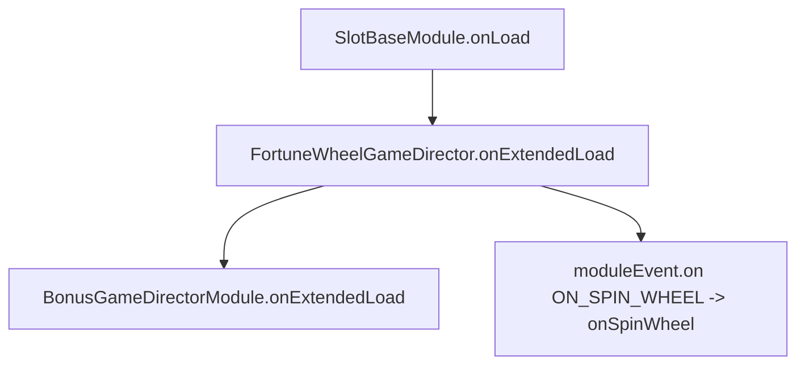

# `FortuneWheelGameDirector.onExtendedLoad(): void`

<!-- convention-summary-start -->
### FortuneWheelGameDirector.onExtendedLoad() Method Specification Summary

- **Core Architecture / Purpose**: Technical reference, API contract, and integration guide for FortuneWheelGameDirector.onExtendedLoad() Method Specification.
- **Key Mechanisms & Design**: Encapsulates core algorithms, event hooks, and performance optimizations within the slot framework runtime.
- **Domain Capabilities**: cc_slot_module, 05_methods
- **Scope & Code Paths**: `assets/cc-common/cc-slot-module/`
- **Related Docs**: [Master Index](../INDEX.md)
<!-- convention-summary-end -->


---

## 1. Method Signature
```typescript
public onExtendedLoad(): void
```

---

## 2. Trigger Source & Lifecycle
* **Invoker**: Called by `SlotBaseModule.onLoad()` during node initialization lifecycle after dependency injection is complete.
* **Timing**: Executed once when `FortuneWheelGameDirector` component awakens in the Cocos scene tree.

---

## 3. Detailed Algorithmic Execution Logic
1. **Invokes Base Class Initialization**: Calls `super.onExtendedLoad()` on `BonusGameDirectorModule` to bind `CLICK_ITEM` and base bonus listeners.
2. **Registers Scoped Event Listener**: Registers listener on `this.moduleEvent` for topic `"ON_SPIN_WHEEL"` pointing to `this.onSpinWheel()`, bound to `this` execution context.

---

## 4. Caller & Callee Relationship


---

## 5. Un-truncated Source Code Implementation
```typescript
onExtendedLoad(): void {
	super.onExtendedLoad();
	this.moduleEvent.on("ON_SPIN_WHEEL", this.onSpinWheel, this);
}
```
