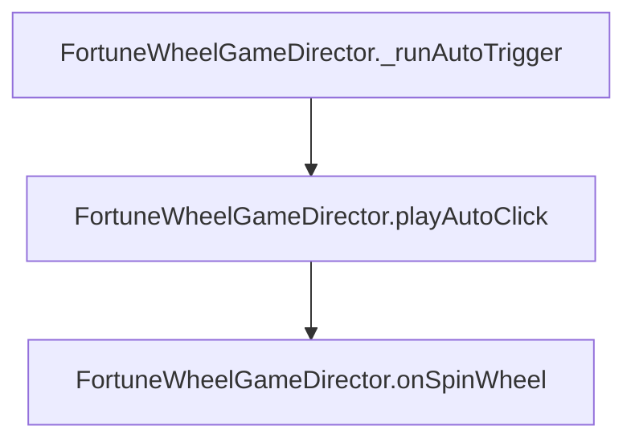

# `FortuneWheelGameDirector.playAutoClick(): void`

<!-- convention-summary-start -->
### FortuneWheelGameDirector.playAutoClick() Method Specification Summary

- **Core Architecture / Purpose**: Technical reference, API contract, and integration guide for FortuneWheelGameDirector.playAutoClick() Method Specification.
- **Key Mechanisms & Design**: Encapsulates core algorithms, event hooks, and performance optimizations within the slot framework runtime.
- **Domain Capabilities**: cc_slot_module, 05_methods
- **Scope & Code Paths**: `assets/cc-common/cc-slot-module/`
- **Related Docs**: [Master Index](../INDEX.md)
<!-- convention-summary-end -->


---

## 1. Method Signature
```typescript
public playAutoClick(): void
```

---

## 2. Trigger Source & Lifecycle
* **Invoker**: Called by `_runAutoTrigger()` upon countdown timer expiration or when auto-play is forced by parent director.
* **Purpose**: Polymorphic override of `BonusGameDirectorModule.playAutoClick()`.

---

## 3. Detailed Algorithmic Execution Logic
1. **Redirects to Spin Action**: Calls `this.onSpinWheel()`, initiating the wheel spin sequence and backend request.

---

## 4. Caller & Callee Relationship


---

## 5. Un-truncated Source Code Implementation
```typescript
playAutoClick(): void {
	this.onSpinWheel();
}
```
