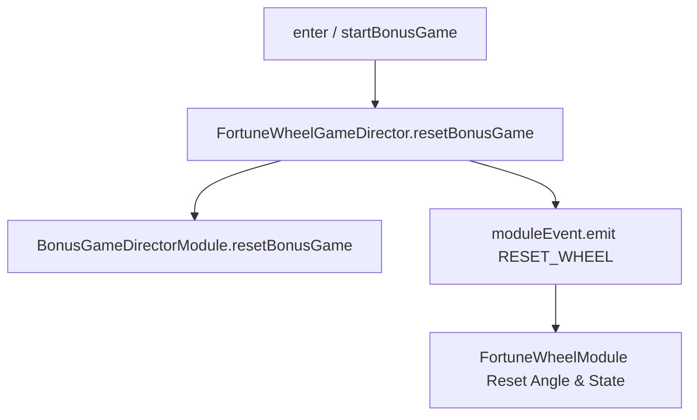

# `FortuneWheelGameDirector.resetBonusGame(): void`

<!-- convention-summary-start -->
### FortuneWheelGameDirector.resetBonusGame() Method Specification Summary

- **Core Architecture / Purpose**: Technical reference, API contract, and integration guide for FortuneWheelGameDirector.resetBonusGame() Method Specification.
- **Key Mechanisms & Design**: Encapsulates core algorithms, event hooks, and performance optimizations within the slot framework runtime.
- **Domain Capabilities**: cc_slot_module, 05_methods
- **Scope & Code Paths**: `assets/cc-common/cc-slot-module/`
- **Related Docs**: [Master Index](../INDEX.md)
<!-- convention-summary-end -->


---

## 1. Method Signature
```typescript
public resetBonusGame(): void
```

---

## 2. Trigger Source & Lifecycle
* **Invoker**: Called when entering or resetting the wheel mini-game, e.g., in `startBonusGame()`, `enter()`, or when round settlement finishes.
* **Purpose**: Resets the visual wheel rotation, stops countdown, and restores initial angle state.

---

## 3. Detailed Algorithmic Execution Logic
1. **Invokes Base Reset**: Calls `super.resetBonusGame()` to reset base properties (`openedBoxes`, `selectedBox`, `isAutoOpen`, unblocking UI).
2. **Emits Wheel Reset Event**: Calls `this.moduleEvent.emit("RESET_WHEEL")` to notify `FortuneWheelModule` to restore default rotation and clear active tweens.

---

## 4. Caller & Callee Relationship


---

## 5. Un-truncated Source Code Implementation
```typescript
resetBonusGame(): void {
	super.resetBonusGame();
	this.moduleEvent.emit("RESET_WHEEL");
}
```
