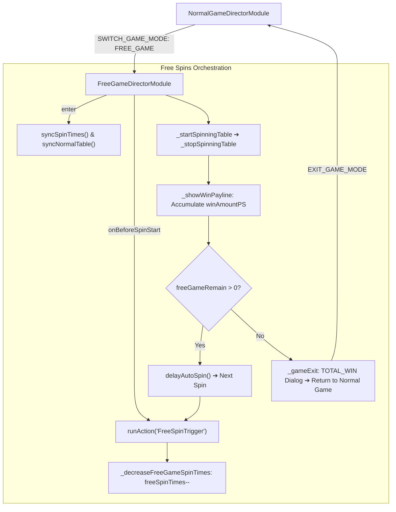

# 🏛️ FreeGameDirectorModule Free Spins Autonomous Orchestrator Architecture

<!-- convention-summary-start -->
### FreeGameDirectorModule Free Spins Autonomous Orchestrator Architecture Summary

- **Core Architecture / Purpose**: Technical reference, API contract, and integration guide for FreeGameDirectorModule Free Spins Autonomous Orchestrator Architecture.
- **Key Mechanisms & Design**: Encapsulates core algorithms, event hooks, and performance optimizations within the slot framework runtime.
- **Domain Capabilities**: cc_slot_module, 01_overview
- **Scope & Code Paths**: `assets/cc-common/cc-slot-module/GameMode/FreeGame/FreeGameDirectorModule.ts`
- **Related Docs**: [Master Index](../INDEX.md)
<!-- convention-summary-end -->

## 1. Executive Summary & Purpose

`FreeGameDirectorModule` (`assets/cc-common/cc-slot-module/GameMode/FreeGame/FreeGameDirectorModule.ts`) is the **Autonomous Feature Orchestrator** for Free Spins rounds in the `cc-common` Slot SDK.

Extending `GameModeDirectorModule`, it manages the entire free spin feature lifecycle:
1. Entering Free Spins mode, playing feature BGM, and initializing the remaining spin badge (`freeSpinTimes`).
2. Syncing the visual table from Normal Game to Free Game reels (`syncNormalTable`, `_resumeFreeTable`).
3. Running continuous, uninhibited auto-spins driven by server session data (`isFirstAutoSpin`, `_beforeSpinStart`).
4. Decrementing remaining spins immediately upon spin launch (`_decreaseFreeGameSpinTimes`).
5. Accumulating free spin winnings (`_showWinPayline`).
6. Concluding the feature and transitioning back to Base Game (`_gameExit`).

---

## 2. Core Responsibilities

1. **Feature Entry & Spin Badge Initialization (`enter`, `syncSpinTimes`)**: Extracts `freeGameRemain` or initial `freeGame` count from `dataStore.playSession`, updates `dataStore.freeSpinTimes`, and updates the HUD badge node via `UPDATE_SPINTIMES`.
2. **Table Reel Synchronization (`syncNormalTable`, `_resumeFreeTable`)**: Emits `SYNC_TABLE` to switch symbols to the Free Spins theme reels or restore matrix state upon reconnection.
3. **Continuous Auto-Spin Loop Orchestration (`_beforeSpinStart`, `delayAutoSpin`)**: Handles auto-spin pacing, skipping delays on initial enter (`isFirstAutoSpin`), and ensuring snappy flow between free spins.
4. **Immediate Badge Decrement (`_decreaseFreeGameSpinTimes`)**: Decrements `freeSpinTimes` locally as soon as reels start moving to give instant player feedback.
5. **Accumulated Free Spins Payout Display (`_showWinPayline`)**: Overrides base payline behavior to display the cumulative session win (`winAmountPS`) rather than isolated line win amounts.
6. **Graceful Feature Teardown (`_gameExit`)**: Clears active payline tracks, resets table matrices, and returns engine control to `NormalGameDirectorModule`.
