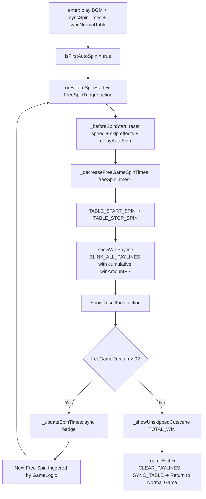

# 🔄 FreeGameDirectorModule Lifecycle & Auto-Spin Flowchart

<!-- convention-summary-start -->
### FreeGameDirectorModule Lifecycle & Auto-Spin Flowchart Summary

- **Core Architecture / Purpose**: Technical reference, API contract, and integration guide for FreeGameDirectorModule Lifecycle & Auto-Spin Flowchart.
- **Key Mechanisms & Design**: Encapsulates core algorithms, event hooks, and performance optimizations within the slot framework runtime.
- **Domain Capabilities**: cc_slot_module, 01_overview
- **Scope & Code Paths**: `assets/cc-common/cc-slot-module/`
- **Related Docs**: [Master Index](../INDEX.md)
<!-- convention-summary-end -->

## 1. Free Spins Lifecycle Flowchart

