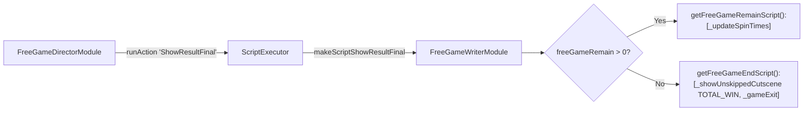

# 🏛️ FreeGameWriterModule Free Spins Script Generator Architecture

<!-- convention-summary-start -->
### FreeGameWriterModule Free Spins Script Generator Architecture Summary

- **Core Architecture / Purpose**: Technical reference, API contract, and integration guide for FreeGameWriterModule Free Spins Script Generator Architecture.
- **Key Mechanisms & Design**: Encapsulates core algorithms, event hooks, and performance optimizations within the slot framework runtime.
- **Domain Capabilities**: cc_slot_module, 01_overview
- **Scope & Code Paths**: `assets/cc-common/cc-slot-module/GameMode/FreeGame/FreeGameWriterModule.ts`
- **Related Docs**: [Master Index](../INDEX.md)
<!-- convention-summary-end -->

## 1. Executive Summary & Purpose

`FreeGameWriterModule` (`assets/cc-common/cc-slot-module/GameMode/FreeGame/FreeGameWriterModule.ts`) is the **Declarative Action Script Generator for Free Spins**.

Extending `GameModeWriterModule`, it compiles the step pipeline for automated free spin rounds. It coordinates countdown counter decrements (`makeScriptFreeSpinTrigger`) and evaluates `freeGameRemain` during round settlements to choose between scheduling the next free spin or launching the `TOTAL_WIN` summary celebration (`getFreeGameEndScript`).

---

## 2. Core Responsibilities

1. **Free Spin Preparation (`makeScriptFreeSpinTrigger`)**: Compiles `_beforeSpinStart`, `_syncPlaySessionData`, `_resetOnSpin`, `_resetTable`, and `_decreaseFreeGameSpinTimes`.
2. **Conditional Settlement Branching (`makeScriptShowResultFinal`)**: Evaluates whether additional free spins remain or if the feature should terminate.
3. **Session Reconnection Pipeline (`makeScriptResumeGameMode`)**: Compiles `_resumeFreeTable` and `_resumeWinAmount`.
