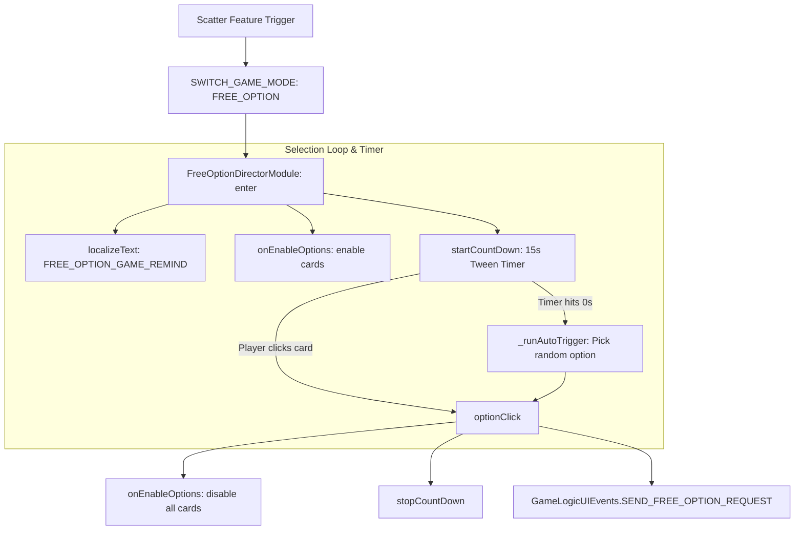

# 🏛️ FreeOptionDirectorModule Interactive Feature Selection Architecture

<!-- convention-summary-start -->
### FreeOptionDirectorModule Interactive Feature Selection Architecture Summary

- **Core Architecture / Purpose**: Technical reference, API contract, and integration guide for FreeOptionDirectorModule Interactive Feature Selection Architecture.
- **Key Mechanisms & Design**: Encapsulates core algorithms, event hooks, and performance optimizations within the slot framework runtime.
- **Domain Capabilities**: cc_slot_module, 01_overview
- **Scope & Code Paths**: `assets/cc-common/cc-slot-module/GameMode/FreeOption/FreeOptionDirectorModule.ts`
- **Related Docs**: [Master Index](../INDEX.md)
<!-- convention-summary-end -->

## 1. Executive Summary & Purpose

`FreeOptionDirectorModule` (`assets/cc-common/cc-slot-module/GameMode/FreeOption/FreeOptionDirectorModule.ts`) is the **Interactive Player Choice & Volatility Selection Engine** for the `cc-common` Slot SDK.

When a feature trigger offers branching game modes (e.g. Low Volatility / High Spins vs High Volatility / Low Spins / Random Mystery), `FreeOptionDirectorModule`:
1. Activates option cards and buttons with custom IDs (`SlotCustomFreeGameOption`).
2. Renders localized reminders (`FREE_OPTION_GAME_REMIND`) with a live 15-second countdown timer.
3. Automatically selects a random option (`_runAutoTrigger`) if the player remains inactive.
4. Prevents duplicate requests by disabling all buttons on click and dispatches `SEND_FREE_OPTION_REQUEST` to the server logic handler.

---

## 2. Core Responsibilities

1. **Option Card Configuration (`options: SlotCustomFreeGameOption[]`)**: Inspects array of option nodes, attaches string/number `optionId` attributes, and controls interactable button states.
2. **Localized Countdown Display (`updateCountdownText`, `startCountDown`)**: Executes a repeating 1-second `cc.tween` on `countDownText` displaying remaining seconds.
3. **Auto-Trigger Fail-safe (`_runAutoTrigger`)**: Selects an option at random (`Math.random() * options.length`) if player input is not received before timer expiration.
4. **Network Dispatch & Anti-Spam (`optionClick`)**: Disables all option buttons immediately upon touch to prevent race conditions and emits `SEND_FREE_OPTION_REQUEST`.
5. **Clean Timer Teardown (`stopCountDown`, `onDestroy`)**: Automatically halts active tween loops to prevent memory leaks and dangling interval executions.
