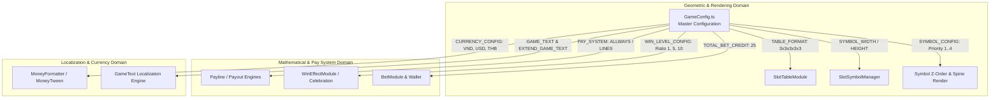

# 🏛️ GameConfig Master Configuration Architecture & Role

<!-- convention-summary-start -->
### GameConfig Master Configuration Architecture & Role Summary

- **Core Architecture / Purpose**: Technical reference, API contract, and integration guide for GameConfig Master Configuration Architecture & Role.
- **Key Mechanisms & Design**: Encapsulates core algorithms, event hooks, and performance optimizations within the slot framework runtime.
- **Domain Capabilities**: cc_slot_module, 01_overview
- **Scope & Code Paths**: `assets/cc-common/cc-slot-module/Core/GameConfig.ts`
- **Related Docs**: [Master Index](../INDEX.md)
<!-- convention-summary-end -->

## 1. Executive Summary & Purpose

`GameConfig` (`assets/cc-common/cc-slot-module/Core/GameConfig.ts`) is the central **Mathematical, Geometric, and Gameplay Configuration Container** in the `cc-common` Slot SDK.

Mounted at `Canvas/Director`, it defines all fundamental slot parameters: grid format (`TABLE_FORMAT`), symbol rendering dimensions (`SYMBOL_WIDTH`, `SYMBOL_HEIGHT`), pay system rules (`PAY_SYSTEM`), win level ratio thresholds (`WIN_LEVEL_CONFIG`), currency formatting matrices (`CURRENCY_CONFIG`), and special symbol priority mapping (`SYMBOL_CONFIG`).

---

## 2. Core Responsibilities

1. **Grid Geometry Definition**: Supplies `TABLE_FORMAT` array (e.g. `[3, 3, 3, 3, 3]` or `[4, 5, 5, 5, 4]`) to `SlotTableModule` for reel generation.
2. **Win Level Escalation Tuning**: Configures `WIN_LEVEL_CONFIG` ratios determining Level 1 (Small Win), Level 2 (Medium Win), Level 3 (Big Win), and Level 4 (Mega/Super Win) animations and coin counting durations.
3. **Multi-Currency Formatting Schema**: Stores `CURRENCY_CONFIG` specifying prefix symbols, decimal counts, and cent unit handling for VND, USD, and THB.
4. **Symbol Z-Index & Hierarchy Rules**: Enforces `SYMBOL_CONFIG` priority order so Wilds and Scatters render consistently on top of low-pay symbols.
