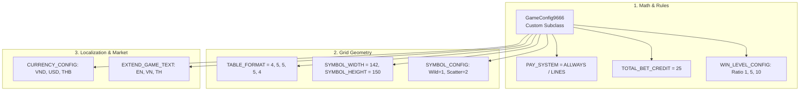

# 🏗️ GameConfig Subclassing & Customization Guide

<!-- convention-summary-start -->
### GameConfig Subclassing & Customization Guide Summary

- **Core Architecture / Purpose**: Technical reference, API contract, and integration guide for GameConfig Subclassing & Customization Guide.
- **Key Mechanisms & Design**: Encapsulates core algorithms, event hooks, and performance optimizations within the slot framework runtime.
- **Domain Capabilities**: cc_slot_module, 09_inheritance_and_customization
- **Scope & Code Paths**: `assets/cc-common/cc-slot-module/`
- **Related Docs**: [Master Index](../INDEX.md)
<!-- convention-summary-end -->


## 1. Class Inheritance Declaration

When creating a new slot title (e.g. Red Cliff `g9666L`), create a subclass of `GameConfig` and attach it to **`Canvas/Director`**:

```typescript
const { _decorator } = cc;
import { GameConfig, PAY_SYSTEM_TYPE_ENUM } from "../../../../cc-common/cc-slot-module/SlotModuleExport";
const { ccclass } = _decorator;

@ccclass("GameConfig9666")
export class GameConfig9666 extends GameConfig {
    public GAME_ID = "9666";
    public JP_PREFIX_EVENT = "9666_";
    public PAY_SYSTEM = PAY_SYSTEM_TYPE_ENUM.ALLWAYS;
    public TOTAL_BET_CREDIT: number = 25;
}
```

---

## 2. Core Customization Domains When Building a Game



---

## 3. Mandatory Overrides Checklist for New Games
1. **`GAME_ID`**: Must match platform game code (used by IoC container, audio player, and WebSocket).
2. **`JP_PREFIX_EVENT`**: Set to `"[GAME_ID]_"` for WebSocket jackpot channel routing.
3. **`TABLE_FORMAT`**: Array defining the number of rows per column (e.g. `[3,3,3,3,3]` for standard 5x3 or `[4,5,5,5,4]` for megaways).
4. **`PAY_SYSTEM`**: Select `PAY_SYSTEM_TYPE_ENUM.ALLWAYS` or `LINES`.
5. **`WIN_LEVEL_CONFIG`**: Tune coin count-up audio durations and big win ratios according to math sheet specs.
