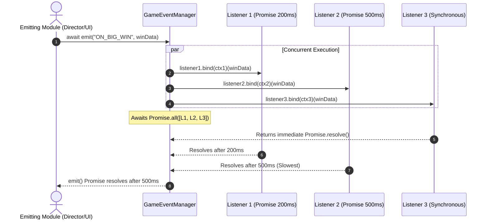

# 🌀 GameEventManager Asynchronous Broadcast Lifecycle

<!-- convention-summary-start -->
### GameEventManager Asynchronous Broadcast Lifecycle Summary

- **Core Architecture / Purpose**: Defines network protocol, socket packet lifecycle, state persistence, and error handling for GameEventManager Asynchronous Broadcast Lifecycle.
- **Key Mechanisms & Design**: Handles WebSocket frame dispatch, acknowledgment confirmation, state resume, and resilient synchronization between client DataStore and Backend Gateway.
- **Domain Capabilities**: cc_slot_module, 02_game_flow
- **Scope & Code Paths**: `assets/cc-common/cc-slot-module/`
- **Related Docs**: [Master Index](../INDEX.md)
<!-- convention-summary-end -->

## 1. Asynchronous Broadcast Flow

When any module calls `this.eventManager.emit("EVENT_NAME", payload)`, `GameEventManager` executes the following asynchronous lifecycle:

