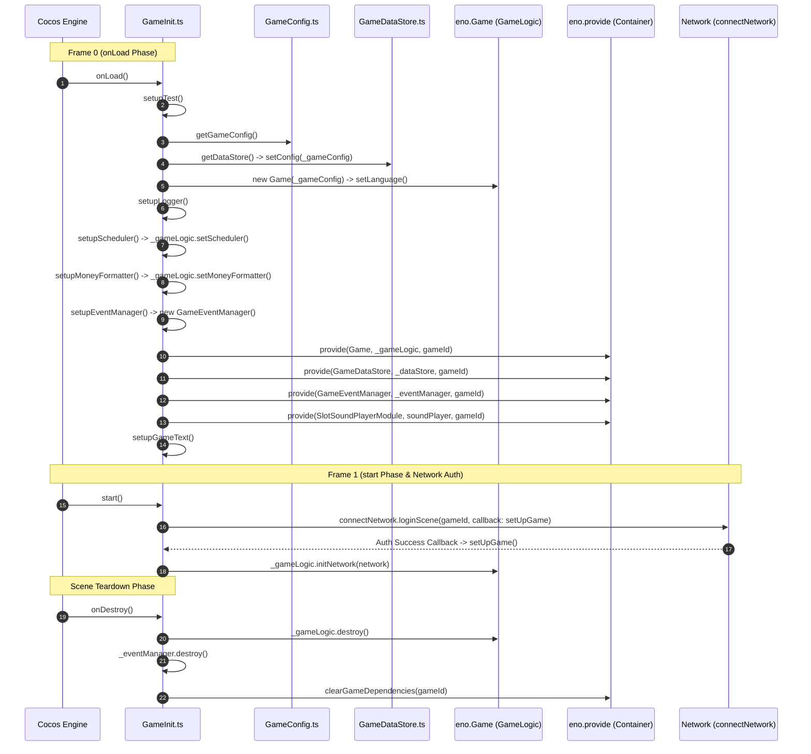

# 🔄 GameInit Lifecycle Flowchart & Bootstrap Sequence

<!-- convention-summary-start -->
### GameInit Lifecycle Flowchart & Bootstrap Sequence Summary

- **Core Architecture / Purpose**: Technical reference, API contract, and integration guide for GameInit Lifecycle Flowchart & Bootstrap Sequence.
- **Key Mechanisms & Design**: Encapsulates core algorithms, event hooks, and performance optimizations within the slot framework runtime.
- **Domain Capabilities**: cc_slot_module, 01_overview
- **Scope & Code Paths**: `assets/cc-common/cc-slot-module/`
- **Related Docs**: [Master Index](../INDEX.md)
<!-- convention-summary-end -->

## 1. Complete Bootstrap Sequence Diagram

---

## 2. Execution Stage Breakdown

1. **`onLoad()` (Synchronous Frame 0)**:
   * Instantiates the core data models and service singletons.
   * Registers all 12 core tokens into `eno.provide(Token, Instance, gameId)`.
2. **`start()` (Frame 1)**:
   * Kicks off `this.connect()` to initialize socket connection and session handshake.
3. **`setUpGame()` (Post-Login Callback)**:
   * Binds socket packet routers to `_gameLogic.initNetwork(network)`.
4. **`onDestroy()` (Scene Unload)**:
   * Calls `clearGameDependencies(gameId)` to prevent singleton memory leaks across scene reloads.
