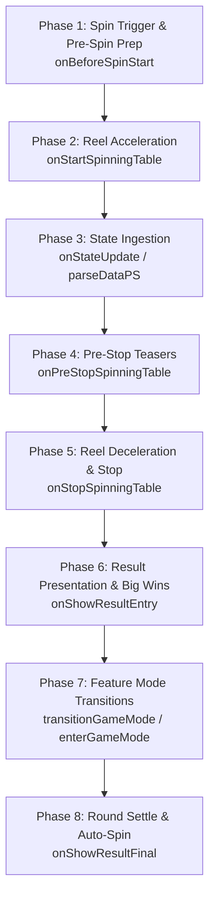

# 🌀 GameModeDirectorModule 8-Phase Spin & Transition Breakdown

<!-- convention-summary-start -->
### GameModeDirectorModule 8-Phase Spin & Transition Breakdown Summary

- **Core Architecture / Purpose**: Defines network protocol, socket packet lifecycle, state persistence, and error handling for GameModeDirectorModule 8-Phase Spin & Transition Breakdown.
- **Key Mechanisms & Design**: Handles WebSocket frame dispatch, acknowledgment confirmation, state resume, and resilient synchronization between client DataStore and Backend Gateway.
- **Domain Capabilities**: cc_slot_module, 02_game_flow
- **Scope & Code Paths**: `assets/cc-common/cc-slot-module/`
- **Related Docs**: [Master Index](../INDEX.md)
<!-- convention-summary-end -->

## 1. The 8 Spin Lifecycle Phases

`GameModeDirectorModule` orchestrates the entire round lifecycle across 8 distinct phases:

---

## 2. Exhaustive Phase Details & Methods Mapping

### Phase 1: Spin Trigger & Pre-Spin Prep (`onBeforeSpinStart`)
* **Trigger**: Player taps Spin button or Auto-Spin counter fires.
* **Internal Action**: Dispatches `runAction("NormalSpinTrigger")`.
* **Director Step Handlers Executed**:
  1. `_beforeSpinStart()`: Resets `gameSpeed`, clears in-flight timers (`skipAllEffects`), and waits for `delayAutoSpin()` (default `0.5s`) if auto-spinning.
  2. `_syncPlaySessionData()`: Synchronizes win amount and balance before betting.
  3. `_pauseWallet()`: Emits `GameUIEvents.WALLET.PAUSE_WALLET` to freeze user balance.
  4. `_resetOnSpin()`: Hook for clearing feature-specific overlays.
  5. `_clearWinAmount()`: Emits `GameUIEvents.WIN_AMOUNT.FADE_OUT_NUMBER`.
  6. `_resetTable()`: Emits scoped `BEFORE_RESET_TABLE`, `CLEAR_PAYLINES`, `SYNC_TABLE` to reset reel symbols.

---

### Phase 2: Reel Acceleration (`onStartSpinningTable`)
* **Trigger**: Pre-spin cleanup completes.
* **Internal Action**: Dispatches `runAction("StartSpinning")`.
* **Director Step Handlers Executed**:
  1. `_startSpinningTable()`: Emits scoped `TABLE_START_SPIN` to `SlotTableModule` to start infinite column spinning.

---

### Phase 3: State Ingestion & Data Store Update (`onStateUpdate`)
* **Trigger**: WebSocket returns server response packet.
* **Execution**:
  1. Calls `this.dataStore.parseDataPS(data)`: Extracts matrices, win lines, jackpot hits, and next mode flags.
  2. Calls `this.dataStore.updateDataModules()`: Broadcasts immutable state update to all reactive components.

---

### Phase 4: Pre-Stop Teasers & Sure-Win Effects (`onPreStopSpinningTable`)
* **Trigger**: WebSocket response is parsed and reels are ready to stop.
* **Internal Action**: Dispatches `runAction("PreStopSpinningTable")`.
* **Director Step Handlers Executed**:
  1. `_syncJackpot()`: If `playSession.jackpot` is present, updates ticker value and pauses jackpot increments.
  2. `_playSureWinEffect()`: Virtual hook for lightning/fire teasers when high-paying wins are guaranteed.
  3. `_playPreStopSpinningEffect()`: Virtual hook for anticipation slow-downs on scatter/bonus columns.

---

### Phase 5: Reel Deceleration & Symbol Landing (`onStopSpinningTable`)
* **Trigger**: Pre-stop teasers finish.
* **Internal Action**: Dispatches `runAction("StopSpinningTable")`.
* **Director Step Handlers Executed**:
  1. `_stopSpinningTable(data)`: Emits scoped `TABLE_STOP_SPIN` to stop reels column by column.
  2. `_setUpPaylines(data)`: Emits scoped `SETUP_PAYLINES` to populate winning payline symbol coordinates.

---

### Phase 6: Result Presentation & Big Wins (`onShowResultEntry`)
* **Trigger**: All reels have landed and bounced to a complete stop.
* **Internal Action**: Dispatches `runAction("ShowResultEntry")`.
* **Director Step Handlers Executed**:
  1. `_playJackpotWin()`: If jackpot hit ➔ Blinks jackpot symbols, plays unskipped jackpot cutscene, and resumes ticker.
  2. `_showResultEntry()`:
     * If `dataStore.isBigWin()` ➔ Calls `_handleBigWin()`:
       * **Normal Speed**: Runs `_blinkAllPaylines()` ➔ Plays full Big Win particle celebration ➔ Updates win counter.
       * **Turbo / FTR Speed**: Calls `_showFastBigWin()` (accelerated counting).
     * Else (Regular Win) ➔ Calls `_showWinPayline()`:
       * Calls `_updateWinningAmount(data)`.
       * Runs `_blinkAllPaylines()` then `_showAllPaylines()`.
       * Awaits `delayAction(delayTime)` unless `canPrepareNextSpin()` is true.

---

### Phase 7: Feature Mode Transitions (`transitionGameMode`)
* **Trigger**: Round contains bonus feature (`nextMode === FREE_GAME` or `BONUS_GAME`).
* **Execution Logic**:
  * If `isResume === true` ➔ Calls `transitionToGameModeWhenResume(mode)` (instantly enters mode without playing intro videos).
  * If `isResume === false` ➔ Dispatches `runAction("TransitionGameMode")`:
    * `_showTransitionFreeGame()`: Blinks scatter symbols (`_showScatterPayLine`) ➔ Plays Intro Free Game Spine dialogue (`_showIntroGameCutscene`).
    * `_showTransitionBonusGame()`: Blinks bonus symbols (`_showBonusPayLine`) ➔ Plays Intro Bonus Game Cutscene.
  * Calls `this.enterGameMode(targetMode)`: Emits global `GameUIEvents.GAME_MODE.SWITCH_GAME_MODE`.

---

### Phase 8: Round Settle & Auto-Spin Continuation (`onShowResultFinal`)
* **Trigger**: Win presentations and transitions finish.
* **Internal Action**: Dispatches `runAction("ShowResultFinal")`.
* **Director Step Handlers Executed**:
  1. `_resumeWallet(force)`: If `playSession.isFinished === true`, emits `GameUIEvents.WALLET.RESUME_WALLET` to roll accumulated winnings into the player's balance.
  2. Re-evaluates `canPrepareNextSpin()`: Unlocks spin button for manual play or schedules next auto-spin loop.
