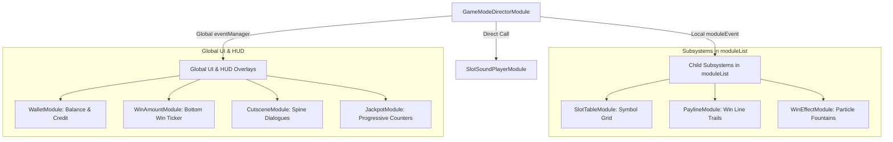

# 🎼 GameModeDirectorModule Pipeline Orchestration & Subsystem Coordination

<!-- convention-summary-start -->
### GameModeDirectorModule Pipeline Orchestration & Subsystem Coordination Summary

- **Core Architecture / Purpose**: Technical reference, API contract, and integration guide for GameModeDirectorModule Pipeline Orchestration & Subsystem Coordination.
- **Key Mechanisms & Design**: Encapsulates core algorithms, event hooks, and performance optimizations within the slot framework runtime.
- **Domain Capabilities**: cc_slot_module, 03_director_writer_integration
- **Scope & Code Paths**: `assets/cc-common/cc-slot-module/`
- **Related Docs**: [Master Index](../INDEX.md)
<!-- convention-summary-end -->

## 1. Subsystem Interaction Architecture

`GameModeDirectorModule` sits as the **command coordinator** between high-level game logic and low-level visual subsystems:

---

## 2. Coordinated Action Step Handlers

| Step Handler Method | Target Subsystem | Invoked Bus Topic | Impact on Game State |
| :--- | :--- | :--- | :--- |
| **`_pauseWallet()`** | Global Wallet | `WALLET.PAUSE_WALLET` | Locks balance display to prevent premature win credit before animations finish. |
| **`_clearWinAmount()`**| Bottom HUD | `WIN_AMOUNT.FADE_OUT_NUMBER` | Clears previous win amount text before new round begins. |
| **`_startSpinningTable()`**| Table Subsystem | `TABLE_START_SPIN` (Scoped) | Initiates reel acceleration. |
| **`_stopSpinningTable(data)`**| Table Subsystem | `TABLE_STOP_SPIN` (Scoped) | Sends target matrix to columns to begin landing sequence. |
| **`_showWinPayline(data)`**| Table & HUD | `SHOW_ALL_PAYLINES`, `WIN_AMOUNT.UPDATE_WIN_AMOUNT` | Renders payline outlines and increments win counter. |
| **`_resumeWallet(force)`**| Global Wallet | `WALLET.RESUME_WALLET` | Rolls total win amount into player wallet balance. |
| **`_syncJackpot()`** | Jackpot Ticker | `JACKPOT.UPDATE_JACKPOT_VALUE`, `PAUSE_JACKPOT` | Pauses background ticker roll while jackpot hit celebration runs. |
