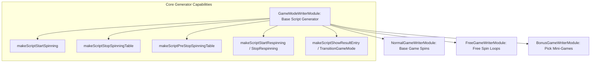

# 🏛️ GameModeWriterModule Master Script Generator Architecture

<!-- convention-summary-start -->
### GameModeWriterModule Master Script Generator Architecture Summary

- **Core Architecture / Purpose**: Technical reference, API contract, and integration guide for GameModeWriterModule Master Script Generator Architecture.
- **Key Mechanisms & Design**: Encapsulates core algorithms, event hooks, and performance optimizations within the slot framework runtime.
- **Domain Capabilities**: cc_slot_module, 01_overview
- **Scope & Code Paths**: `assets/cc-common/cc-slot-module/GameMode/GameModeWriterModule.ts`
- **Related Docs**: [Master Index](../INDEX.md)
<!-- convention-summary-end -->

## 1. Executive Summary & Purpose

`GameModeWriterModule` (`assets/cc-common/cc-slot-module/GameMode/GameModeWriterModule.ts`) is the **Root Abstract Script Generator Base Class** for all game mode writers (`NormalGameWriterModule`, `FreeGameWriterModule`, `BonusGameWriterModule`).

Extending `SlotBaseModule`, it binds itself to the mode container node via `this.node["writer"] = this` and defines the default, out-of-the-box action script generator methods for starting spins, stopping reels, executing anticipation teasers, running cascade respins, and triggering game mode transitions.

---

## 2. Core Responsibilities

1. **Self-Registration on Node (`onLoadExtend`)**: Assigns `this.node["writer"] = this` so `BaseGameDirector.init()` can locate and bind it to `ScriptExecutor`.
2. **Default Spin Pipelines**: Provides standard command descriptor arrays for starting reels (`_startSpinningTable`), stopping reels (`_stopSpinningTable`, `_setUpPaylines`), and stopping respins (`_showRespinResultEntry`, `_stopRespinningTable`, `_setUpPaylines`, `_showRespinResultFinal`).
3. **Emergency Stop Scripting (`makeScriptStopCurrentGameMode`)**: Compiles `_stopCurrentGameMode` and `_forceResetGameMode` for rapid teardown.
