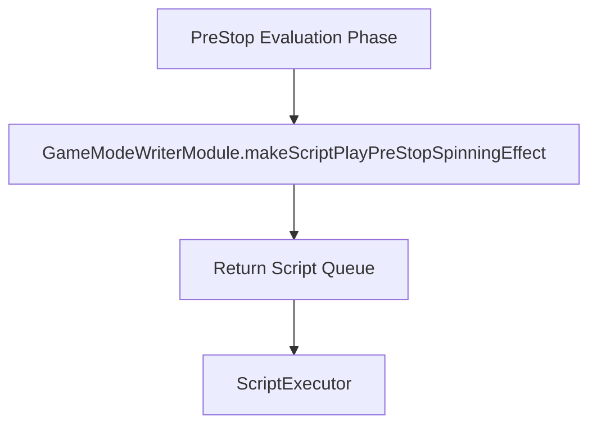

# `GameModeWriterModule.makeScriptPlayPreStopSpinningEffect(): Object[]`

<!-- convention-summary-start -->
### GameModeWriterModule.makeScriptPlayPreStopSpinningEffect() Method Specification Summary

- **Core Architecture / Purpose**: Technical reference, API contract, and integration guide for GameModeWriterModule.makeScriptPlayPreStopSpinningEffect() Method Specification.
- **Key Mechanisms & Design**: Encapsulates core algorithms, event hooks, and performance optimizations within the slot framework runtime.
- **Domain Capabilities**: cc_slot_module, 05_methods
- **Scope & Code Paths**: `assets/cc-common/cc-slot-module/`
- **Related Docs**: [Master Index](../INDEX.md)
<!-- convention-summary-end -->


---

## 1. Method Signature
```typescript
public makeScriptPlayPreStopSpinningEffect(): Object[]
```

---

## 2. Trigger Source & Lifecycle
* **Invoker**: Called by Director / Writer pipeline when evaluating pre-stop anticipation effects (such as near-win scatter anticipation, expanding wild tease animations, or feature anticipation).
* **Purpose**: Virtual hook allowing game modes to generate custom pre-stop visual/sound action sequences before the reels begin decelerating.

---

## 3. Detailed Algorithmic Execution Logic
1. **Initializes Empty Command Array**: Instantiates `listScript = []`.
2. **Returns Extensible Array**: Returns empty array in the base class. Overridden by specific game writers (e.g. `NormalGameWriterModule`, `FreeGameWriterModule`) to push commands like `_showNearWinEffect` or `_playExpandingWildTease`.

---

## 4. Caller & Callee Relationship


---

## 5. Un-truncated Source Code Implementation
```typescript
makeScriptPlayPreStopSpinningEffect(): Object[] {
	let listScript = [];
	return listScript;
};
```
