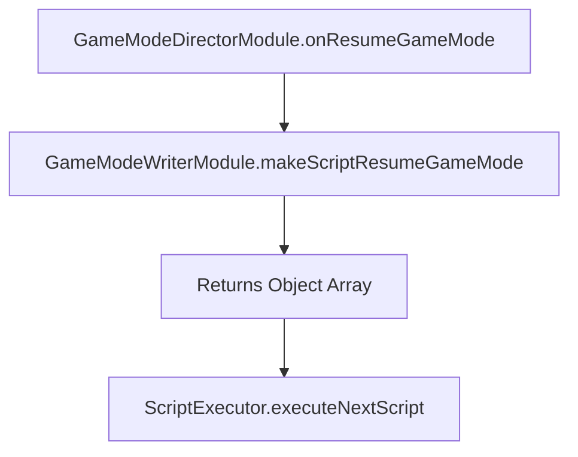

# `GameModeWriterModule.makeScriptResumeGameMode(): Object[]`

<!-- convention-summary-start -->
### GameModeWriterModule.makeScriptResumeGameMode() Method Specification Summary

- **Core Architecture / Purpose**: Technical reference, API contract, and integration guide for GameModeWriterModule.makeScriptResumeGameMode() Method Specification.
- **Key Mechanisms & Design**: Encapsulates core algorithms, event hooks, and performance optimizations within the slot framework runtime.
- **Domain Capabilities**: cc_slot_module, 05_methods
- **Scope & Code Paths**: `assets/cc-common/cc-slot-module/`
- **Related Docs**: [Master Index](../INDEX.md)
<!-- convention-summary-end -->


---

## 1. Method Signature
```typescript
public makeScriptResumeGameMode(): Object[]
```

---

## 2. Trigger Source & Lifecycle
* **Invoker**: Called by `GameModeDirectorModule` / `BaseGameDirector` during reconnection hydration when resuming an in-progress game mode (`isResume = true`).
* **Purpose**: Generates the action queue required to restore UI, table matrices, multipliers, and remaining spin counters when a player reconnects into an ongoing feature.

---

## 3. Detailed Algorithmic Execution Logic
1. **Initializes Empty Command Array**: Instantiates `listScript = []`.
2. **Returns Default Virtual Implementation**: Returns the empty script list. Subclasses (e.g. `FreeGameWriterModule`, `BonusGameWriterModule`) override this method to inject specific resume commands such as `_updateSpinTimes`, `_updateMultiplier`, and `_restoreMatrix`.

---

## 4. Caller & Callee Relationship


---

## 5. Un-truncated Source Code Implementation
```typescript
makeScriptResumeGameMode(): Object[] {
	let listScript = [];
	return listScript;
}
```
