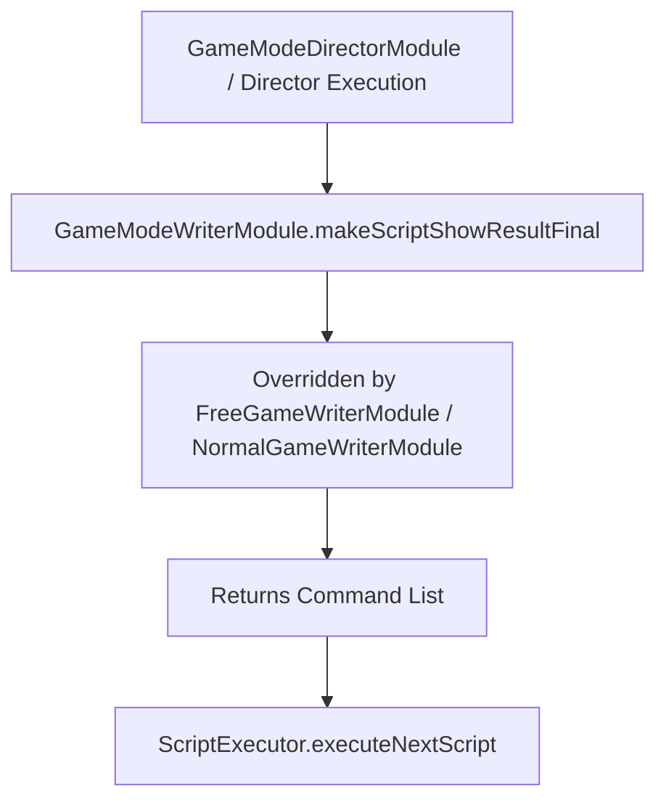

# `GameModeWriterModule.makeScriptShowResultFinal(): Object[]`

<!-- convention-summary-start -->
### GameModeWriterModule.makeScriptShowResultFinal() Method Specification Summary

- **Core Architecture / Purpose**: Technical reference, API contract, and integration guide for GameModeWriterModule.makeScriptShowResultFinal() Method Specification.
- **Key Mechanisms & Design**: Encapsulates core algorithms, event hooks, and performance optimizations within the slot framework runtime.
- **Domain Capabilities**: cc_slot_module, 05_methods
- **Scope & Code Paths**: `assets/cc-common/cc-slot-module/`
- **Related Docs**: [Master Index](../INDEX.md)
<!-- convention-summary-end -->


---

## 1. Method Signature
```typescript
public makeScriptShowResultFinal(): Object[]
```

---

## 2. Trigger Source & Lifecycle
* **Invoker**: Called by Director when completing the final stage of round settlement (after `makeScriptShowResultEntry`).
* **Purpose**: Virtual extension point intended to be overridden in concrete mode writers (`NormalGameWriterModule`, `FreeGameWriterModule`, `BonusGameWriterModule`) to push final round actions, cutscenes, win summaries, or trigger evaluations.

---

## 3. Detailed Algorithmic Execution Logic
1. **Initializes Empty Command Array**: Instantiates `listScript = []`.
2. **Returns Extensible Array**: In `GameModeWriterModule` base class, returns empty array `[]`. Subclasses override this method to inject game-specific finale commands (e.g. `_showNormalGameWinEffect`, `_updateSpinTimes`, `_showUnskippedCutscene`).

---

## 4. Caller & Callee Relationship


---

## 5. Un-truncated Source Code Implementation
```typescript
// override in game mode writer
makeScriptShowResultFinal(): Object[] {
	let listScript = [];
	return listScript;
};
```
