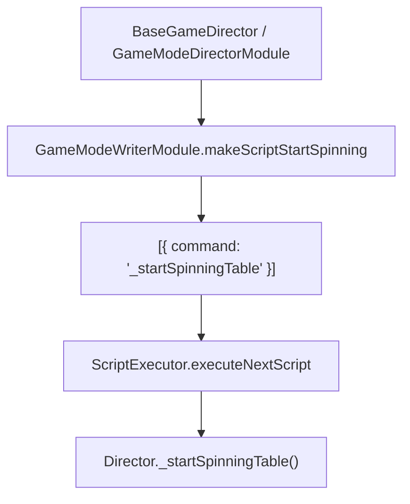

# `GameModeWriterModule.makeScriptStartSpinning(): Object[]`

<!-- convention-summary-start -->
### GameModeWriterModule.makeScriptStartSpinning() Method Specification Summary

- **Core Architecture / Purpose**: Technical reference, API contract, and integration guide for GameModeWriterModule.makeScriptStartSpinning() Method Specification.
- **Key Mechanisms & Design**: Encapsulates core algorithms, event hooks, and performance optimizations within the slot framework runtime.
- **Domain Capabilities**: cc_slot_module, 05_methods
- **Scope & Code Paths**: `assets/cc-common/cc-slot-module/`
- **Related Docs**: [Master Index](../INDEX.md)
<!-- convention-summary-end -->


---

## 1. Method Signature
```typescript
public makeScriptStartSpinning(): Object[]
```

---

## 2. Trigger Source & Lifecycle
* **Invoker**: Called by `BaseGameDirector.onStartSpinning()` or `GameModeDirectorModule` when a spin starts.
* **Purpose**: Generates the command queue to start the table reels spinning.

---

## 3. Detailed Algorithmic Execution Logic
1. **Instantiates Script Array**: Initializes `listScript = []`.
2. **Enqueues Start Spinning Command**: Pushes `{ command: "_startSpinningTable" }`.
3. **Returns Script Array**: Returns `[{ command: "_startSpinningTable" }]`. When processed by `ScriptExecutor`, invokes `Director._startSpinningTable()`.

---

## 4. Caller & Callee Relationship


---

## 5. Un-truncated Source Code Implementation
```typescript
makeScriptStartSpinning(): Object[] {
	let listScript = [];
	listScript.push({
		command: "_startSpinningTable",
	});
	return listScript;
};
```
