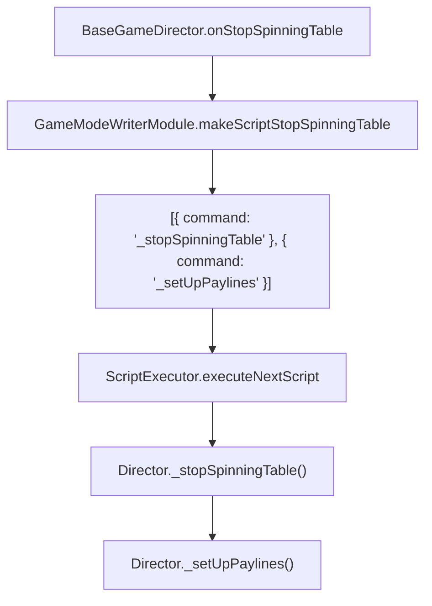

# `GameModeWriterModule.makeScriptStopSpinningTable(): Object[]`

<!-- convention-summary-start -->
### GameModeWriterModule.makeScriptStopSpinningTable() Method Specification Summary

- **Core Architecture / Purpose**: Technical reference, API contract, and integration guide for GameModeWriterModule.makeScriptStopSpinningTable() Method Specification.
- **Key Mechanisms & Design**: Encapsulates core algorithms, event hooks, and performance optimizations within the slot framework runtime.
- **Domain Capabilities**: cc_slot_module, 05_methods
- **Scope & Code Paths**: `assets/cc-common/cc-slot-module/`
- **Related Docs**: [Master Index](../INDEX.md)
<!-- convention-summary-end -->


---

## 1. Method Signature
```typescript
public makeScriptStopSpinningTable(): Object[]
```

---

## 2. Trigger Source & Lifecycle
* **Invoker**: Called by `BaseGameDirector.onStopSpinningTable()` or mode directors when server spin response is received and table stop begins.
* **Purpose**: Generates the primary two-step command sequence: stopping reels to display server matrix, then configuring paylines based on winning lines.

---

## 3. Detailed Algorithmic Execution Logic
1. **Initializes Command List**: `listScript = []`.
2. **Pushes Table Stop Command**: Adds `{ command: "_stopSpinningTable" }` (triggers reel deceleration, bounce landing, and symbol visibility updates).
3. **Pushes Payline Setup Command**: Adds `{ command: "_setUpPaylines" }` (draws winning lines, highlights winning symbol coordinates, and prepares payline presentation).
4. **Returns Array**: Returns `[{ command: "_stopSpinningTable" }, { command: "_setUpPaylines" }]`.

---

## 4. Caller & Callee Relationship


---

## 5. Un-truncated Source Code Implementation
```typescript
makeScriptStopSpinningTable(): Object[] {
	let listScript = [];
	listScript.push({
		command: "_stopSpinningTable",
	});
	listScript.push({
		command: "_setUpPaylines",
	});
	return listScript;
};
```
